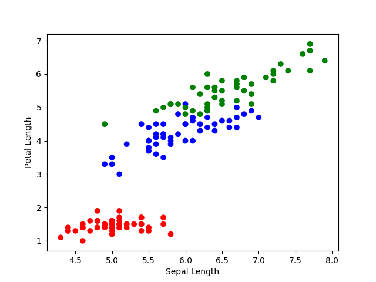
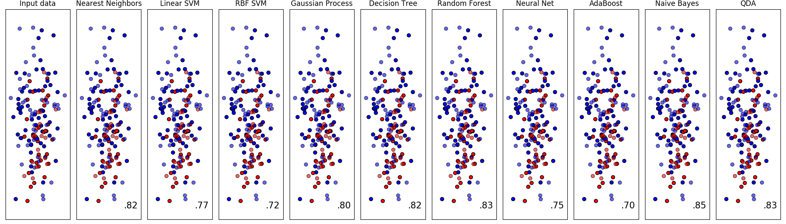

# Projects
## Enigma 2020
### About

Enigma is a competitive ciphering and deciphering heist while looking for clues in the gigantic internet universe. Explore some amazing corners of the web-battling out puzzles and reading between the lines. Got stuck on some questions? Work your way out through your search engines. 

### Leaderboard

<ul><li><b>290 / 355 Kowalski Analysis</b></li><li><b>285 / 355 Living Immortals</b></li> <li>270 / 355 Chillminati</li> <li>270 / 355 Aam Aadmi Party</li> <li>260 / 355 Pigs Are Awesome</li> <li>240 / 355 404!</li> <li>225 / 355 Team Snow</li> <li>215 / 355 strugglers</li> <li>200 / 355 Cicada3301</li> <li>180 / 355 the beacons</li> <li>145 / 355 turingBois</li> <li>135 / 355 The Deathly Hallows</li> <li>120 / 355 execute ?</li> <li>120 / 355 DedSec</li> <li>120 / 355 Anything is fine</li> <li>60 / 355 SaCreD MaFiA</li></ul>

### Goal
Enigma as a medium is our way of exposing the participants to a myriad of exciting places on the internet. We strive to provide an unparalleled experience similar to an open world game — explore the depths of internet for clues, crack mind-bending puzzles, and get to know more about the rad things people are doing in the world.

Every team's journey is unique and depends on how they approach a problem. Every question has a unique solution and it doesn't matter what path you take, it's important to remember <b>what</b> you're looking for. It's easy to get lost, you see.

### Rules
Rulebook can be found <a href='../media/enigma/rulebook.pdf'>here</a>

### Questions
Questions will be posted here soon.

### Creators

 
 

<b>Priyansh Sangule</b>

Prelims & Finals

 
 
<b> Anup Kulkarni</b>
Prelims & Finals

  
 

<b>Aditya Chaudhary </b>
Prelims

  
 
<b>Sibibalan </b>
Prelims

## Enigma 2019
### About

Enigma is a competitive ciphering and deciphering heist while looking for clues in the gigantic internet universe. Explore some amazing corners of the web-battling out puzzles and reading between the lines. Got stuck on some questions? Work your way out through your search engines.

### Feedback

<ul><li>\"Some are mind-bending, some are deep, some are clueless. It's an awesome experience overall.\" <b> — Sai Krupa Reddy, IIT Tirupati</b></li> <li>\"Even though we couldn't come up with proper logics or answers, it was fun!!\"<li><b>—Hemangi Doye, IIM Indore</b></li> <li>\"Horiffying. Enthralling. We loved it! Enjoyed the ride. Wish to solve many more of these again and again.\"<b> — Aparna Vadlamani, IIT Tirupati</b></li> <li>\"It is an awesome,  brain storming event and best one I have ever attempted. I would love to participate even after my B.Tech.\"<b> — Sai Sumanth Vanka, IIT Tirupati</b></li></ul>

### Insight

 Insights for the event could be found <a href='../media/enigma/enigma_2019_insights.png'> here</a>

According to the statistics, we found the prelims results to be really skewed even though the questions were relatively simple compared to finals. We decided to increase the duration of the Prelims for the next event to 12 hours.

### Leaderboards

The following list contains the marks scored and members for the respective teams for Enigma2019 Finals.

<ul><li>222 / 469 Raghav Dhawan | B. Varnika | Sandalika Sapra </li><li>203 / 469 Jakku Sai Krupa Reddy | Dasari Merwin | Sathwik Matsa </li><li>202 / 469 Sai Sumanth Vanka | Vuduthala Pratyusha | Tapan Ganatma </li><li>201 / 469 Aakash Yadav | Bhomik | Vishal </li><li>151 / 469 Rutvik Bade | Ayush Garg | Ravi Shrivatsa </li><li>146 / 469 V Dheeraj | Kalicheti Rishitha</li><li>143 / 469 A Chaitanya | Charan Sai | G Yaswanth </li><li>123 / 469 Manoj kumar | Ritesh Sai T. | Akhil Bharadwaj</li><li>116 / 469 Vasunith Kislay | Manish Kumar Shrivastava | Tejasva Motsara</li><li>101 / 469 Sriram | Akhil | Chandan</li><li>85  / 469 Rohith Sudheer | Prudvi Venkat | Shubham Sangle </li><li> 83  / 469 Reena Deshmukh</li><li> 79  / 469 Aparna Vadlamani | G Sushmita</li><li> 69  / 469 Bodapati Nirupama Sai | Ambati Amulya | Balasa Niharika </li><li> 68  / 469 Ajinkya Kamble | Krishan Kumar Rao | Nakshatra Gupta</li><li> 67  / 469 Raj Garg | Abhishek Kaushik | Deep Ghadiyali </li><li> 66  / 469 Shubhankar Bhadra</li><li> 66  / 469 Abhishek Kumar | Arnab Dutta | Devayan Barindranath Ghosh </li><li> 66  / 469 Shaik Irfan | Vinay Koneru | Yashwant Sai Koneru</li><li> 39  / 469 Nandita V Nair | Kaushal Pillay | Revathy Sajeev </li></ul>

### Questions

Prelims questions were created by both <a href='https://www.twitter.com/AnupKulkarn1'>Anup Kulkarni</a> and I. Questions for finals were created by me. Questions could be found here: <a href='enigma_2019_prelims.html'>prelims</a>

# Articles
## C++ STL
### Vector
[ | | | | =>
- [Fast] Insert at back: <b>O(1)</b>
- [Slow] Insert in beginning or middle: <b>O(n)</b>
- [Slow] Search: <b>O(n)</b> 

- #include &lt;vector&gt
- vector&lt;int&gt vec;
- vec.push_back(5);
- vec.at(0); //Throws range_error exception
- vec.empty(); //<b>bool</b> Check if empty
- vec.size();
- vector&lt;int&gt; vec2(vec); // Copy constructor copies vec into vec2
- vec.clear();
- vec.swap(vec2);
Iterators
- for(vector&lt;int&gt;::<b>iterator</b> itr = vec.begin(); itr!=vec.end(); itr++){
- &nbsp; cout &lt;&lt;  *itr &lt;&lt; endl; // *itr gives value stored
- }
Alternatively for C++11,
- for(auto it:vec) // Use &it for reference, if one wants changes in values
- &nbsp; cout &lt;&lt; it &lt;&lt; endl; 
### Deque
<= | | | | =>
- [Fast] Insert at front and back: <b>O(1)</b>
- [Slow] Insert in middle: <b>O(n)</b>
- [Slow] Search: <b>O(n)</b> 
Implementation similar to vector
- #include&lt;deque&gt;
- deque&lt;int&gt; deq = {4,6,7};
- deq.push_front(3);
- deq.push_back(8); 
### List
 [ ] <-> [ ] <-> [ ]
- [Fast] Insert and Remove anywhere: <b>O(1)</b>
- [Slow] Search: <b>O(n)</b> 
Implementation
- #include&lt;list&gt;
- list&lt;int&gt; listt = {5,2,9};
- listt.push_back(2);
- listt.push_front(1);
Find
- list&lt;int&gt;::iterator itr = <b>find</b>(listt.begin(), listt.end(),2); //itr -> 2
Insert
- listt.insert(itr, 8); // Inserts in front of itr
- itr++
- listt.erase(itr)
Splice: Copies elements from list2 (from itr_a to itr_b) to list1 at itr
- list1.splice(itr,list2,itr_a,itr_b);
### Array
Thin layer around the naked array.
- int a[3] = {3,4,5};
- array&lt;int,<b>3</b>&gt; a = {3,4,5}; // Array container of type (int,3)
Limitations
- Size is fixed : array&lt;int,<b>fixed_size</b>&gt;;
- array&lt;int,<b>3</b>&gt; and array&lt;int,<b>4</b>&gt; are different types.
Usage
- a.swap();
- a.size();
- a.begin();
- a.end();
### Set 
- [Slow] Insert <b>O(log(n))</b>
- [Fast] Search <b>O(log(n))</b>

- <b>Non duplicate data
- Value of elements cannot be modified</b>

Do not use sets for simpler problems as insertion takes time and will cause performance issues.

- #include&lt;set&gt;
- set&lt;int&gt; myset;
- myset.insert(2);
- set&lt;int&gt;::iterator it;
- it = myset.<b>find</b>(7);

- pair&lt;set&lt;int&gt;::<b>iterator, bool</b>&gt; ret; // ret.second='false' if already exists
- ret = myset.insert(3);
Insert via <i>hint</i>.
- myset.insert(itr,9);
'itr' is hint. O(log(n)) => O(1). The better the hint, the better the performance.
Erase
- myset.erase(itr);
- myset.erase(7); // By <b>value!</b>  
### Multiset
- [Fast] Search O(log(n))
- [Slow] Traversing
- <b>A set that allows duplicate items
- Value of elements cannot be modified</b>

- multiset&lt;int&gt; myset;
### Map
- [Fast] Find O(log(n))
- <b> No duplicate key
- Keys cannot be modified
- Type of itr: pair&lt;char,int&gt;</b>
Implementation
- map&lt;char,int&gt; mymap;
Insertion
- mymap.insert(pair&lt;char,int&gt;('a',100));
- mymap.insert(make_pair('z',200));
- mymap.insert(itr,pair&lt;char,int&gt;('a',300)); // itr is a hint.
### Multimap
- <b>Allows duplicate keys
- Keys cannot be modified
- Type of itr: pair&lt;char,int&gt;</b>

- (*itr).first = 'd'; // Error
### Resources
- [Associative containers](https://www.youtube.com/watch?v=6iyzPed7FrM)
## Practical Machine Learning
### Basics
- Go through Andrew Ng lectures and lecture notes(for revision).
- Read cheatsheets for Pandas, Sklearn and Matplotlib
### Classifiers
Classifying [Iris-dataset](https://www.kaggle.com/arshid/iris-flower-dataset)
Import csv file using pandas
- pd.read_csv('IRIS.csv')
Visualize the data

Implementing various classifiers and find max accuracy classifier

