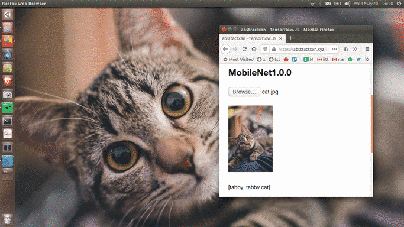
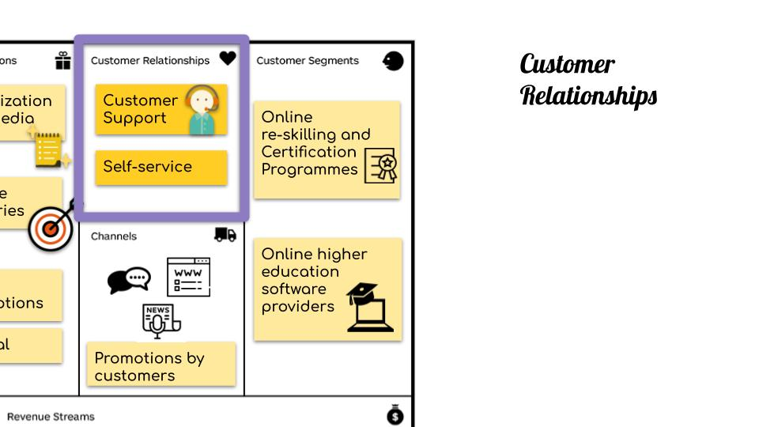
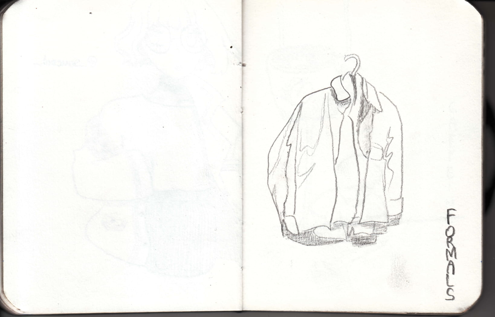
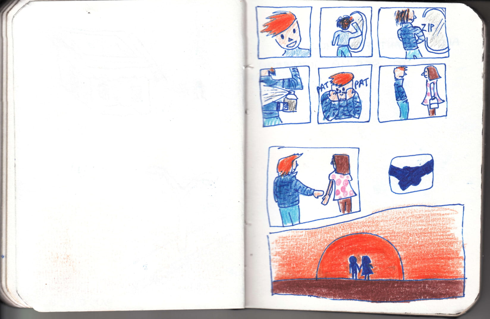
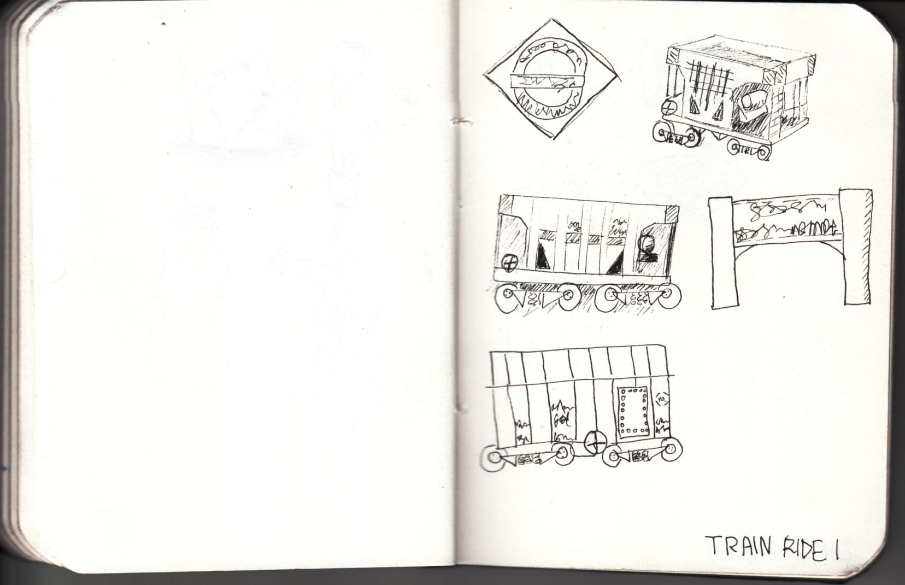

# Home
## About
### Me

  

Hello, I'm Priyansh Sangule, 4th year Computer Science and Engineering student at <a href='https://www.iittp.ac.in'>IIT Tirupati</a>. [Resume](../media/Priyansh_Sangule_Resume.pdf)

I'm an extremely motivated individual who likes to tackle problems and tinker with the latest technology. 

Currently, I manage Mizi ,a static site generator, which is being used to build this website. My plans include improving Mizi and build my time tracker.

I have an insatiable thirst for knowledge and use it to improve my approach to problems. I am always fascinated by the ocean of unexplored knowledge that lies beyond. I constantly push myself to explore more. I am very glad to be surrounded by amazing individuals who keep inspiring me to learn and create something new and exciting every day.  

Various things that intrigue me are named data networking(NDN), machine/deep learning, better quality code practices, game development, C++, gaming.

### Website
This website exists as a knowledge base for curating ideas, technology, art, activity logs.

### Goal
Further advance the fields of science and arts. Creating low level simple and sharp softwares that help people create and inspire others.

### Contribute

Website is currently under development.

Source files for my projects could be found on <a href='https://www.github.com/abstractxan'>Github</a>. This website is made with C++ using  <a href='https://www.github.com/abstractxan/mizi'>Mizi</a>. Source files for my website are available <a href='https://www.github.com/abstractxan/abstractxan/tree/master/src'>here</a>.
 
Inspired by <a href='https://solar.lowtechmagazine.com/2018/09/how-to-build-a-lowtech-website/'>low-tech web design</a>, most images on this website are <i>dithered</i>. This website is heavily inspired by <a href='https://100r.co'>100 Rabbits</a>.
 
Found a typo? Feel free to open an <a href='github.com/abstractxan/abstractxan/issues/new'>issue</a>.

## Journal
###  
Journal shows recent updates.

250920 - RSS Reader for updates

080920 - Won the CS50 Puzzle Day | [Team](https://cs50.smugmug.com/CS50-Puzzle-Day-2020/i-zL4RXrS/A)

220820 - Learning [Vim](./vim.html)!

160820 - Getting a feel of some PHP

110820 - Learning AWS Lamda and Serverless applications

180720 - Programming with Google Go Specialization | [Coursera](https://coursera.org/share/9fe09f16123983bb2df8fc8ae2d11861) | [Code](https://github.com/AbstractXan/Golang/blob/master/Coursera/)

030720 - Object Oriented Programming in Golang | [Notes](https://github.com/AbstractXan/Golang/blob/master/Coursera/2%20Functions%2C%20Methods%2C%20and%20Interfaces%20in%20Go/week3/notes.md) | [Coursera](https://www.coursera.org/learn/golang-functions-methods)

090620 - miniNDN experiments | [Github](https://github.com/AbstractXan/minindn-experiments)

250520 - Golang

250520 - Orange

220520 - Database Concepts Notes

190520 - MobileNet tf.js [implementation](./tensorflowjs.html#MobileNetv1.0.0) | [image](https://unsplash.com/photos/9SWHIgu8A8k)

180520 - Object Detection | [image](https://unsplash.com/photos/HdtIiGcIQtU)

170520 - [Perlin Noise](./unity2d.html#better_perlin_noise__octaves)

150520 - CNN Cat/Dog [Model](./deep_learning_image_classification.html)

## Bucket List
###  
- [x] Create my own website
- [ ] Create my own font
- [x] Personal Time Logger : Jikan
- [ ] Get a Gramophone
- [ ] Own a vinyl record of my own songs 
- [ ] Learn longboarding
- [ ] Create LINK DUMP webpage

# Projects

## Mizi
### Introduction

<a href='https://github.com/abstractxan/mizi'>Mizi</a> is a static website generator written in C++ that takes markdown file as input.

### Philosophy

Mizi is designed to be light weight, minimalistic and convenient. It is created in an attempt to help people create websites easily and without any prior web development experience.

## Mini-projects
### Shooting Stars

<iframe src='https://itch.io/embed/566225' height='auto' width='100%' frameborder='0'><a href='https://abstractxan.itch.io/shooting-stars'>Shooting stars by AbstractXan</a></iframe>

### Space 

<iframe src='https://itch.io/embed/543741' height='auto' width='100%' frameborder='0'><a href='https://abstractxan.itch.io/space'>Space by AbstractXan</a></iframe>

## Enigma 2020
### About

Enigma is a competitive ciphering and deciphering heist while looking for clues in the gigantic internet universe. Explore some amazing corners of the web-battling out puzzles and reading between the lines. Got stuck on some questions? Work your way out through your search engines. 

### Leaderboard

<ul><li><b>290 / 355 Kowalski Analysis</b></li><li><b>285 / 355 Living Immortals</b></li> <li>270 / 355 Chillminati</li> <li>270 / 355 Aam Aadmi Party</li> <li>260 / 355 Pigs Are Awesome</li> <li>240 / 355 404!</li> <li>225 / 355 Team Snow</li> <li>215 / 355 strugglers</li> <li>200 / 355 Cicada3301</li> <li>180 / 355 the beacons</li> <li>145 / 355 turingBois</li> <li>135 / 355 The Deathly Hallows</li> <li>120 / 355 execute ?</li> <li>120 / 355 DedSec</li> <li>120 / 355 Anything is fine</li> <li>60 / 355 SaCreD MaFiA</li></ul>

### Goal
Enigma as a medium is our way of exposing the participants to a myriad of exciting places on the internet. We strive to provide an unparalleled experience similar to an open world game — explore the depths of internet for clues, crack mind-bending puzzles, and get to know more about the rad things people are doing in the world.

Every team's journey is unique and depends on how they approach a problem. Every question has a unique solution and it doesn't matter what path you take, it's important to remember <b>what</b> you're looking for. It's easy to get lost, you see.

### Rules
Rulebook can be found <a href='../media/enigma/rulebook.pdf'>here</a>

### Questions
Questions will be posted here soon.

### Creators

 
 

<b>Priyansh Sangule</b>

Prelims & Finals

 
 
<b> Anup Kulkarni</b>
Prelims & Finals

  
 

<b>Aditya Chaudhary </b>
Prelims

  
 
<b>Sibibalan </b>
Prelims

## Enigma 2019
### About

Enigma is a competitive ciphering and deciphering heist while looking for clues in the gigantic internet universe. Explore some amazing corners of the web-battling out puzzles and reading between the lines. Got stuck on some questions? Work your way out through your search engines.

### Feedback

<ul><li>\"Some are mind-bending, some are deep, some are clueless. It's an awesome experience overall.\" <b> — Sai Krupa Reddy, IIT Tirupati</b></li> <li>\"Even though we couldn't come up with proper logics or answers, it was fun!!\"<li><b>—Hemangi Doye, IIM Indore</b></li> <li>\"Horiffying. Enthralling. We loved it! Enjoyed the ride. Wish to solve many more of these again and again.\"<b> — Aparna Vadlamani, IIT Tirupati</b></li> <li>\"It is an awesome,  brain storming event and best one I have ever attempted. I would love to participate even after my B.Tech.\"<b> — Sai Sumanth Vanka, IIT Tirupati</b></li></ul>

### Insight

 Insights for the event could be found <a href='../media/enigma/enigma_2019_insights.png'> here</a>

According to the statistics, we found the prelims results to be really skewed even though the questions were relatively simple compared to finals. We decided to increase the duration of the Prelims for the next event to 12 hours.

### Leaderboards

The following list contains the marks scored and members for the respective teams for Enigma2019 Finals.

<ul><li>222 / 469 Raghav Dhawan | B. Varnika | Sandalika Sapra </li><li>203 / 469 Jakku Sai Krupa Reddy | Dasari Merwin | Sathwik Matsa </li><li>202 / 469 Sai Sumanth Vanka | Vuduthala Pratyusha | Tapan Ganatma </li><li>201 / 469 Aakash Yadav | Bhomik | Vishal </li><li>151 / 469 Rutvik Bade | Ayush Garg | Ravi Shrivatsa </li><li>146 / 469 V Dheeraj | Kalicheti Rishitha</li><li>143 / 469 A Chaitanya | Charan Sai | G Yaswanth </li><li>123 / 469 Manoj kumar | Ritesh Sai T. | Akhil Bharadwaj</li><li>116 / 469 Vasunith Kislay | Manish Kumar Shrivastava | Tejasva Motsara</li><li>101 / 469 Sriram | Akhil | Chandan</li><li>85  / 469 Rohith Sudheer | Prudvi Venkat | Shubham Sangle </li><li> 83  / 469 Reena Deshmukh</li><li> 79  / 469 Aparna Vadlamani | G Sushmita</li><li> 69  / 469 Bodapati Nirupama Sai | Ambati Amulya | Balasa Niharika </li><li> 68  / 469 Ajinkya Kamble | Krishan Kumar Rao | Nakshatra Gupta</li><li> 67  / 469 Raj Garg | Abhishek Kaushik | Deep Ghadiyali </li><li> 66  / 469 Shubhankar Bhadra</li><li> 66  / 469 Abhishek Kumar | Arnab Dutta | Devayan Barindranath Ghosh </li><li> 66  / 469 Shaik Irfan | Vinay Koneru | Yashwant Sai Koneru</li><li> 39  / 469 Nandita V Nair | Kaushal Pillay | Revathy Sajeev </li></ul>

### Questions

Prelims questions were created by both <a href='https://www.twitter.com/AnupKulkarn1'>Anup Kulkarni</a> and I. Questions for finals were created by me. Questions could be found here: <a href='enigma_2019_prelims.html'>prelims</a>

## ID5022
### Introduction
ID5022: Entreprenuership and Innovation final project
### Slides

## Tensorflow.JS

### MobileNet1.0.0
[MobileNets](https://github.com/tensorflow/models/blob/master/research/slim/nets/mobilenet_v1.md) are models parameterized to meet the resource constraints of a variety of use cases. They can be built upon for classification, detection, embeddings and segmentation.

One could use mobilenet pretrained models using tf.js as given [here](https://github.com/tensorflow/tfjs-models/tree/master/mobilenet)

Upload image to classify using mobilenet 

<input type='file' /> 

# Articles
## Raspberry Pi
### Introduction
[WIP]
### Getting started
The fun way of doing RPi is probably using it without periherals. Simply SSH into it! Though you do need to set up OS and Wifi config correctly.

### SSH into RPi
To [SSH](https://www.ssh.com/ssh/) into RPi, refer this [article](https://itsfoss.com/ssh-into-raspberry/). 

### File Transfer
- Downloading- 
- $ scp pi@RPI-ADDR:/home/pi/file.zip HOST-PATH
- Uploading-
- $ scp file.zip pi@RPI-ADDR:/home/pi

Know more about SCP [here](https://tecadmin.net/download-file-using-ssh/)

### Web server

- 1. You could start off by creating a web server using [nginX](http://nginx.org/en/). Do '$ apt get install nginx'

- 2. This will setup a server on the RPi. Do a quick 'ifconfig' to get the IP address for the RPi and try it out on other devices in the same network.

- 3. To make changes to your website head over to /var/www/html

- 4. Create a new file 'index.html' and start building up your server. If your website doesn't look awesome, why not add some styling using [Bootstrap](https://getbootstrap.com)? Simply import the required scripts and get started.
 
<b>Known issues:</b> 
- + If you're unable to fetch images/content -- try doing 'sudo chmod +x 0755 *' in '/var/www/html'

### VNC
Why even bother using the HDMI ports? Get [VNC](https://www.raspberrypi.org/documentation/remote-access/vnc/) to use your RPI on any device.

## Data
### Standardization

Average
Variance
Standard Deviation (sd)
<pre class="code">
sd = population_sd / SQRT(sample_size)
</pre>
<pre class="code">
x' = x - mu / sd
</pre>

### Information:

Entropy:

Mutual Information/ Information Gain:
<pre class="code">
I(x,y) = H(x) - H(x|y) 
</pre>

[Information Entropy](https://www.youtube.com/watch?v=2s3aJfRr9gE)

## MS Excel

### Introduction
This is an attempt to understanding data and analytics using MS Excel.

MS Excel V16.4

### Name Range
Name ranges could be used as variables to put into formulas. Makes the workflow easy and convenient to search and manage.

### Functions
Aggregation
- = SUM(&lt;range&gt;)
- = SUMIF(&lt;range&gt;, "<500")
- = SUMIF(&lt;criteria_range&gt;, "&lt;criteria&gt;", &lt;SUM_RANGE&gt;)
- = SUMIFS( &lt;sum_range&gt;, &lt;criteria_range_1&gt;, "&lt;criteria_1&gt;", [&lt;criteria_range_2&gt;, "&lt;criteria_2&gt;"])
- = SUMPRODUCT(&lt;array_1&gt;, &lt;array_2&gt;)

Count
- = COUNT(&lt;range&gt;)
- = COUNTA(&lt;range&gt;)
- = COUNTBLANK(&lt;range&gt;)
- = COUNTIF(&lt;criteria_range&gt;, "&lt;criteria&gt;", &lt;count_range&gt;)
- = COUNTIFS(&lt;count_range&gt;, &lt;criteria_range_1&gt;, "&lt;criteria_1&gt;", [&lt;criteria_range_2&gt;, "&lt;criteria_2&gt;"])

COUNT -- Considers only numbers. 
COUNTA -- Considers text

Average functions
- = AVERAGE(&lt;range&gt;)
- = AVERAGEA()
- = AVERAGEIF(&lt;criteria_range&gt;, "&lt;criteria&gt;")
- = COUNTIF(&lt;criteria_range&gt;, "&lt;criteria&gt;", &lt;average_range&gt;)
- = AVERAGEIFS(&lt;average_range&gt;, &lt;criteria_range_1&gt;, "&lt;criteria_1&gt;", [&lt;criteria_range_2&gt;, "&lt;criteria_2&gt;"]) 

AVERAGE -- Consideres only numbers ; Omits text from counting. 
AVERAGEA -- Considers text in the counting.

Rand
- = RAND()
- = RAND()*100 
- = RANDBETWEEN(&lt;bottom&gt;, &lt;top&gt;)

Round

- = ROUND(&lt;number&gt;,&lt;decimal_position&gt;)
- = ROUNDUP(&lt;number&gt;,&lt;decimal_position&gt;)
- = ROUNDDOWN(&lt;number&gt;,&lt;decimal_position&gt;)

Decimal position +2 is hundredth decimal place. Similarly -3 is thousands place.
- = ROUND(23.557, 2) = 23.560
- = ROUND(2555, -3) = 3000 

ROUNDUP and ROUNDDOWN are like Ceil() and Floor().
- = ROUNDUP(100.001,0) = 101
- = ROUNDDOWN(100.999,0) = 100

Subtotals : 
- Data -> Subtotal
Grouping and totalling data wrt changes in columns. Does data folding as well.

### Date and Time functions
- = TODAY() , YEAR() , MONTH() , DAY()
- = WORKDAY(), WEEKDAY(), WEEKNUM(), EOMONTH()
- = EDATE(&lt;date&gt;,&lt;months&gt;)
- = NETWORKDAYS(start_date,end_date,[holidays])
- = NOW() , HOUR() , MINUTE() , SECOND() , TIME(hour,minute,second)
- = DATEDIF(start_date,end_date,"&lt;format&gt;")
- Where format could be : "Y" , "M" , "D" , "YM" ,"MD"

### Text Functions
- = TRIM(), LOWER(), UPPER(), PROPER()
- = LEFT(text,[&lt; num_chars &gt;]) , RIGHT(...)
- = MID(text,start_num, [&lt; num_chars &gt;])

- = FIND(find_text,within_text)
- = SEARCH() , REPLACE(), SUBSTITUE()

- = CONCATENATE(), TEXT(), LEN(), CHAR(), CODE()

CHAR and CODE convert from and to ASCII

### Statistical functions
- = MIN(), MINA(), MAX(), MAXA(), MEDIANS()

### Lookup

- Lookup Table : The table data used to lookup
- LookUp Value : The value against which we search. 

- = VLOOKUP(lookup_value,table_array,col_index_num,match_type)
Vlookup could be used along with <b>Data -> Data Validation -> Allow "List"</b> to create a dropdown for the possible values. Lookup value should be <b>unique</b> and should belong to the <b>first column</b> of the array.

- = HLOOKUP(lookup_value,table_array,row_index_num,match_type)
- = LOOKUP(lookup_value,lookup_vector,result_vector)

Lookup vector should be sorted in <b>ascending</b> order and should have <b>unique values</b>

### Pivot tables
Pivot tables are used to aggregate data and group them w.r.t criteria. Here's a reference video to understand the expected behaviour.

<iframe width="100%" height="auto" src="https://www.youtube.com/embed/FoKzK3YfYoY" frameborder="0" allow="accelerometer; autoplay; encrypted-media; gyroscope; picture-in-picture" allowfullscreen></iframe>

### Slicers
Slicers are visual filters in the form of interactive buttons. They are used to filter the data present in the pivot table.

### Ordered pair functions
- = SLOPE(y_array,x_array)
- = INTERCEPT(y_array,x_array)
- = CORREL(array_1,array_2)
- = RSQ(y_array,x_array)

Correlation: CORREL
R-Squared:

### Solver
The solver add in could be used to solve optimization problems.

## Vim
### Introduction
Vim is a 'modal' editr i.e it's got modes

Modes:
- Command : Default, press <kbd>esc</kbd> to reach here
- Insert : Press <kbd>i</kbd>
- Write : Press <kbd>w</kbd>
- Quit : Press <kbd>q</kbd>
### Commands
- Delete a line[Command mode] :DD
- Delete 3 lines [Commmand mode] :3 DD
- Undo [Command mode] :U
- Redo [Command mode] :Ctl + R
- Searching [Command mode] :/&lt;text&gt; 
- Search and Replace All (greedy) :%s/&lt;search text&gt;/&lt;replace - text&gt;/g

### Links
- Vim [Cheetsheet](http://vimsheet.com)
- [VimCasts](http://vimcasts.org)
- [SuperTab](https://youtube.com/watch?v=BhwtnCaFTFk) plugin
- [Improving Vim Speed](https://youtube.com/watch?v=watch?v=OnUiHLYZgaA)
- Ctabs plugin
- Macros [vimcast](http://vimcasts.org/episodes/converting-markdown-to-structured-html-with-a-macro/)

## PHP
### Introduction
PHP : PHP Hypertext Preprocessor is a programming language that allows developers to create dynamic content that interact with databses. It is used to create web based software applications.

Get WAMP / MAMP for windows / linux.

### Hello World
<pre class="code">
&lt;!-- /htdocs/index.php--&gt;
&lt;body&gt;
    &lt;?php
        echo "Hello World";
    ?&gt;
&lt;/body&gt;
</pre>

### Forms and requests
<pre class="code">
&lt;!-- /htdocs/index.php--&gt;
&lt;form action="process.php" method="post"&gt;
    Enter your name &lt;input name="name" type="text"&gt;
    &lt;input type="submit"&gt;
&lt;/form&gt;

&lt;!-- /htdocs/process.php--&gt;
&lt;body&gt;
    &lt;?php
        echo "Hello ," . $_POST["name"];
    ?&gt;
&lt;/body&gt;
</pre>

### Links
- [Learn PHP in 15min](https://www.youtube.com/watch?v=ZdP0KM49IVk) - Jake Wright

Last Modified: 16th Aug 2020

## Serverless
### Introduction

### Quick start
Prerequisite: 
- 1. AWS account 
- 2. Globally installed [serverless](https://www.npmjs.com/package/serverless) with [AWS serverless config](https://www.serverless.com/framework/docs/providers/aws/cli-reference/config-credentials/)

1. Create 'hello-world-function' from hello-world template:
<pre class="code">
serverless create --template hello-world --path hello-world-function
</pre>

2. Test/invoke on local:
<pre class="code">
serverless invoke local --function helloWorld
</pre>

3. Deploy
<pre class="code">
serverless deploy
</pre>

This would deploy the lambda function and give HTTP endpoint like:
- endpoints:
- GET — https://oyqliuc8hd.execute-api.us-east-1.amazonaws.com/dev/hello-world

### Serverless.yml
[WIP]
### Links
- 1. [Getting started with serverless functions using NodeJS and AWS](https://medium.com/@ashwinsoni/getting-started-with-serverless-functions-using-nodejs-and-aws-eef8c84abbf3)

## Diffie-Hellmann Key Exchange
### Introduction
- Public key exchange protocol
- [Group](https://en.wikipedia.org/wiki/Multiplicative_group_of_integers_modulo_n) based cryptography

A and B can agree on a secret key while communicating over a public/insecure network!

### Flavour
Given: <b>A</b> and <b>B</b> want to agree upon a secret colour. Eavesdropper <b>C</b> who is able to intercept their messages.
Assumption: Color seperation is expensive.
- - A and B <i>publically</i> agree on a common colour P.
- - A and B choose some secret <i>colour</i> X and Y respectively.
- - A mixes P+X and sends to B
- - B mixes P+Y and sends to A
- - C intercepts P+x and P+Y
- - A and B then mix their personal secret colours to the received colors.
- - A's new mix = P+Y+X
- - B's new mix = P+X+Y
- - A and B arrive at the same colour
C could not come up with P , X and Y from P+X and P+Y as they are <i>almost</i> inseperable. C is unable to make P+X+Y and thus P+X+Y is now the secure private key for A and B.

- Source:Wikipedia

### Simple cryptographic use case
A and B publicly agree on a prime number <b>p</b> (say 23). A and B then agree on a generator <b>g</b> (say 5) belonging to {1, ... , p-1}. (More on this below)

- - A chooses secret integer a=11 and computes A1 = g^a mod p = 5^13 mod 23 = <b>21</b>
- - B chooses secret integer b=9 and computes B1 = g^b mod p = 5^9 mod 23 = <b>11</b>
- - A and B exchange A1 and B1
- - C intercepts A1=<b>21</b> and B1=<b>11</b>
- - *MAGIC*
- - A performs B1^a mod 23 = 11^13 mod 23 = 17
- - B performs A1^b mod 23 = 21^9 mod 23 = 17
- - Thus A and B could now use this an their encryption key.

This is because (g^a)^b mod p = (g^b)^a mod p
i.e. (g^a mod p)^b mod p =  (g^b mod p)^a mod p
Even though C is aware of prime number p, generator G, A's message A1 and B's message B1; C is unable to generate the new secret key as it is computationally intractable to find secret keys from A1 and B1 i.e. It is hard to figure out x in g^x mod p = A1

But is this secure enough? 

### Discrete Logarithm Problem
Given  p , g ,  g^x mod p , find x. This problem gets really hard for very large prime values of p. Finding the solution in polynomial time is still an [unsolved problem](https://en.wikipedia.org/wiki/List_of_unsolved_problems_in_computer_science#Polynomial_versus_non-polynomial_time_for_specific_algorithmic_problems) in computer science. Thus, the strength of the Diffie-Hellman key exchange is the Discrete Logarithm Problem.

Why generators? What do they generate?

### Group
A group is a set with operation under : <i> closure , existence of inverse element , associativity, existence of identity element </i>. For instance, (Z,+) is integer group under addition.

Groups which can be generated by a single element are called <b>cyclic</b> groups. These special elements are called <b> generators</b>.

Example: Consider a dot operation defined as <b>a . b = (a*b) mod n</b> over a simple group G : {1,2,3,4} for n = 5
Also consider the notation that a[i] = ((a . a ). a) ... (i times).
Now, a number g from G will be called a generator if it performs the operation on itself to generate the whole group.

- 1 : 1[i] = ( 1^i mod 5 ) = {1} for any i
- 2 : 2[i] = ( 2^i mod 5 ) = {2,4,3,1} for i=1,2,3,4 respectively = G 
- 3 : 3[i] = ( 3^i mod 5 ) = {3,4,2,1} for i=1,2,3,4 respectively = G
- 4 : 4[i] = ( 4^i mod 5 ) = {4,1} for i=1,2 and so on..

Since, we can generate G from 2 and 3, they are the <i>generators of group (G,dot) </i>. 

Generators have a property that g^i mod p generate a group of numbers between 1 to p-1 and that every number is equally likely to be generated. This group is called [<i>multiplicative group of integers modulo <b>n</b></i>](https://en.wikipedia.org/wiki/Multiplicative_group_of_integers_modulo_n). It is defined as a group of integers coprime to <b>n</b> from the set {0,1,...n-1} under <i>multiplication modulo n</i>. (a . b = (a*b) mod n). Since our p is prime, the generated group includes all numbers from 1 to p-1.

This way, the encryption key could take any value between 1 to p-1 equally likely and thus it is harder to guess for larger values of p.

Such cyclic groups modulo p, a large prime number, and a corresponding generator ([primitive root modulo p](https://en.wikipedia.org/wiki/Primitive_root_modulo_n) ) g are used to create secure public key transfer protocol given that discreet logarithm problem is hard to solve.
### Flaws
Impersonation issues. Any information passed to the insecure channel could be intercepted by an impersonator who could act like the actual receiver.
### Further

We realise that since we use a <i>large</i> prime p, the encryption key becomes <b>huge</b> as well, as g^ab mod p always lies between 1 to p-1. This proves to be memory extensive.

An interesting area is [Elliptic curve cryptography](https://www.youtube.com/watch?v=gAtBM06xwaw) which tends to reduce the encryption key size and provide equivalent security.

Last Updated: 3 April 2020

## SQL
### Introduction
Structured Query Language. Keywords are case insensitive.
[DBMS notes](https://github.com/AbstractXan/notes/blob/master/pdf/6%20DBMS.pdf)

### Links
- [MySQL Tutorial](https://www.mysqltutorial.org/basic-mysql-tutorial.aspx)
- [20 Important Queries](https://bytescout.com/blog/20-important-sql-queries.html#17)
### mySQL using Docker
A basic working SQL server.
- docker pull mysql
- docker create network work
- docker run --name testmysql --network work -e MYSQL_ROOT_PASSWORD=password -d mysql:latest
- docker run -it --network work --rm mysql mysql -htestmysql -uroot -p
- #(Enter 'password' as your password)

Pull docker image. Create a network. Start a server in a container. Create a client container and access the server.

### Video
<iframe width="100%" height="auto" src="https://www.youtube.com/embed/hGlvp5YgAvM" frameborder="0" allow="accelerometer; autoplay; encrypted-media; gyroscope; picture-in-picture" allowfullscreen></iframe>

### Commands
- show databases;
- create database test;
- use test;
- create table t ( col1 char , col2 int);
- insert into t values ('a',1),('b',2);
- <b>SELECT</b> * from t;
- select col1 from t <b>WHERE</b> col2 = 1;
- select col2 from t where col1 <b>LIKE</b> 'a%';
- select distinct city FROM station WHERE city REGEXP "^[aeiou].*";

[REGEX](https://dev.mysql.com/doc/refman/5.7/en/regexp.html)

AGGREGATION
- MIN, MAX, COUNT, AVG

GROUP BY
- select col1 , count(col1) from t group by col1;

JOINS
- select t1.col1 , t2.col1 from t1 <b>INNER JOIN</b>  t2 ON t1.col2 = t2.col2;
-  select t1.col1 , t2.col1 from t1 <b>LEFT JOIN</b>  t2 ON t1.col2 = t2.col2;
- select t1.col1 , t2.col1 from t1 <b>RIGHT JOIN</b> t2 ON t1.col2 = t2.col2;

UNION => DISTINCT 
UNION ALL => DUPLICATES allowed
- select * from t1 <b>UNION</b> select * from t2;

### Curated Questions
1. Query even ID numbers in table STATION.
- select * from station where <b>MOD(id,2)</b>=0;
2. Query to find the difference between the total number of cities and the unique number of cities in the table STATION.
- select <b>count(city)-count(distinct city)</b> from station;
3. Query city with the longest name from table STATION
- select city from station orderby length(city) <b>desc, city limit 1</b>;
4. Query the list of CITY names starting with vowels (i.e., a, e, i, o, or u) from STATION. Result cannot contain duplicates.
- select distinct city FROM station WHERE city REGEXP "^[aeiou].*";

## Deep Learning Image Classification
### Notebook
The following content is best understood with [Tensorflow Tutorial](https://www.tensorflow.org/tutorials/images/classification)
### Input

### Data

### Model

Could even add Dropout layer after first (convolutional) and last (dense) layers to avoid overfitting.
### Result

## Object Oriented Programming
### C++ Classes 
<pre class="code">
class Box {
    public:
    double length;   // Length of a box
    double breadth;  // Breadth of a box
    double height;   // Height of a box
};
</pre>

Creating objects:
<pre class="code">
Box Box1;
</pre>

Accessing data members (dot operator):
<pre class="code">
Box1.length
</pre>

C++ Classes and Objects in detail: [here](https://www.tutorialspoint.com/cplusplus/cpp_classes_objects.htm)
### Abstraction
Using abstract class/Interface we express the intent of the class rather than the actual implementation.
### Encapsulation
Encapsulation — private instance variable and public accessor methods.

### Inheritence
### Polymorphism
Polymorphism occurs when there is a hierarchy of classes and they are related by inheritance.

C++ polymorphism means that a call to a member function will cause a different function to be executed depending on the type of object that invokes the function. (Overriding)

<b>Virtual Function</b>
This could be fixed by using 'virtual' keyword for the parent function.

Defining a virtual function for a base class, with another version in a derived class, signals to the compiler that we don't want static linkage for this function. Instead, we want the function to be called at any given point in the program to be based on the kind of object for which it is called. This sort of operation is referred to as <b>dynamic linkage</b>, or late binding.

<b>Pure Virtual Function</b>
Defining virtual function in a base class so that it may be redefined in a derived class to suit the objects of that class, but that there is no meaningful definition you could give for the function in the base class.

<pre class="code">
virtual int area() = 0;
</pre>

### Overloading
More than one definition for an operator or a function with different parameters and usage ; used in the same scope.

Function overloading:
<pre class="code">
void print(double  f) {
    cout << "Printing float: " << f << endl;
}
void print(char* c) {
    cout << "Printing character: " << c << endl;
}
</pre>

Operator overloading:
<pre class="code">
class Box {
    ...
    Box operator+(const Box& b) {
        Box box;
        box.length = this->length + b.length;
        box.breadth = this->breadth + b.breadth;
        box.height = this->height + b.height;
        return box;
    }
    ...
};
...
Box3 = Box1 + Box2;
</pre>

## C++ STL Cheatsheet
### Vector
Initiatlisation:
<pre class="code">
vector&lt;int&gt; a{1,2,3};
vector&lt;int&gt; b(a);
vector&lt;int&gt;> c(2,3); //[2,2,2]
vector&lt;vector&lt;int&gt;&gt; d(vector&lt;int&gt;(0,2),2); // [ [0,0] , [0,0] ]
</pre>
Methods:
<pre class="code">
vector&lt;int&gt;::iterator it = vec.begin();
vector&lt;int&gt;::iterator it = vec.end();
---
int size = vec.size();
vec.push_back( 5 );
vec.erase( it );
int elem = vec[0];
---
for (auto elem : vec){...}
</pre>

## Unity2D

### Links
- [User interface and screen resolution](https://www.youtube.com/watch?v=_RIsfVOqTaE)
- [Building a save system](https://www.youtube.com/watch?v=5roZtuqZyuw)

### Movement Scipt
<pre class="code">
// Update is called once per frame
void Update(){
    float moveSpeed = 10;
    float horizontalInput = Input.GetAxis("Horizontal");
    float verticalInput = Input.GetAxis("Vertical");
    transform.Translate(new Vector3(horizontalInput, verticalInput, 0 ) * moveSpeed * Time.deltaTime);
}
</pre>

### Collision Detection
Objects must have collider component. Objects must have rigidbody for enabling physics engine controls. Refer RigidBody2D [Manual](https://docs.unity3d.com/Manual/class-Rigidbody2D.html).
<pre class="code">
OnCollisionEnter2D(Collider2D other){
    if (other.gameObject.CompareTag("tag")){
    Debug.Log("HIT tag");     
    }
}
</pre>

### Basic Perlin Noise

<pre class="code">
public static float[,] GenerateNoiseMap(int mapWidth, int mapHeight, float scale){
    
    float[,] noiseMap = new float[mapWidth,mapHeight];
    if ( scale <= 0 ){ scale = 0.001F; }
    for (int y = 0 ; y < mapHeight ; y++){
        for (int x = 0 ; x < mapWidth ; x++){
            float sampleX = x/scale;
            float sampleY = y/scale;
            float perlinValue = Mathf.PerlinNoise(sampleX,sampleY);
            noiseMap[x,y] = perlinValue;
        }
    }
    return noiseMap;
}
</pre>
    
### Better Perlin Noise : Octaves
<iframe width="100%" height="auto" src="https://www.youtube.com/embed/RC9lg2K0wzM" frameborder="0" allow="gyroscope;" allowfullscreen></iframe>

### Time
Time.deltaTime : The completion time in seconds since the last frame (Read Only).This property provides the time between the current and previous frame.

Last Updated: 24 Sep 2020

## Git
### Introduction
Version control systems like Git are tools used to track changes to source code (or other collections of files and folders). As the name implies, these tools help maintain a history of changes; furthermore, they facilitate collaboration. Source : [Missing-Semester/Git](https://missing.csail.mit.edu/2020/version-control/)
[Documentation](https://git-scm.com/docs)
<pre class="code">
    
    --- Initialize repository
    $ git init
    --- Add / Delete from Staging 
    $ git add .
    $ git checkout -- .
    --- Commits 
    $ git commit -m "First Commit"
    $ git commit --amend -m "An updated commit message"
    ---
    $ git status
    ---
    $ git log
    $ git log --all --graph --decorate
    ---
    $ git checkout &lt;commit-id&gt;
    $ git checkout -b &lt;branch&gt; 
    ---
    $ git diff
    ---
    $ git merge &lt;branch-name&gt;
    --- Go back in time
    $ git reflog
    $ git reset HEAD@{&lt;id&gt;}
    -- Change history in remote
    $ git reset --hard HEAD~&lt;number-of-commits-to-undo&gt;
    $ git push origin HEAD -f

</pre>

### Terminology
- <b>Init</b>: Initialises git repo. Creates ".git" directory
- <b>Add</b>: Adds the changes in current directory to staging area
- <b>Commit</b>: Commits the staged changes to snapshot graph. 
- <b>Status</b>: Shows the details of current changes and latest snapshot
- <b>Log</b>: Shows flattened version of the commit history. Could be 
- <b>Checkout</b>: Moves head pointer and mutates contents of working directory corresponding to that commit. Could create a new branch.
- <b>Merge</b>: Merges current branch with branch specified. Could "auto-merge" or may cause "merge conflict" 
    In case of merge conflict, resolve conflict manually / using VSCode / other tools.
- <b>Remote</b>: Remote repositories are versions of your project that are hosted on the internet/network somewhere. Remotes enable collaboration.

### Links
- [Git tutorials](https://www.youtube.com/channel/UCrl5xG-L4ZCFkR-bhUy9BVg) by Youtube/Tower
- Atlassian [git tutorial](https://www.atlassian.com/git/tutorials)

## Golang
###  
[WIP]
### Todo
- [x] Functions
- [x] Array & Slices
- [ ] Structures, Methods
- [ ] Interface
- [ ] Errors

### Functions

Call by Value
<pre class="code">
func foo(y int){
	y = y+2
}

func main(){
	x := 2
	foo(x)
	fmt.Println(x)
}
</pre>

- Pros : Encapsulation
- Cons : Copy time

Call by Pointers
<pre class="code">
func foo(y *int){
	*y = *y+2
}

func main(){
	x := 2
	foo(&x)
	fmt.Println(x)
}
</pre>

- Pros : No extra copy time
- Cons : No encapsulation

[There is no pass by reference in go](https://dave.cheney.net/2017/04/29/there-is-no-pass-by-reference-in-go)

<b> Functional cohesion : </b> Function should perform only one "operation"

Function are <b> first-class </b> 

Variables as functions
<pre class="code">
func incFunc(x int) int {
	return x+1
}
func main(){
	var funcVar func(int) int
	funcVar = incFunc
	fmt.Println(funcVar(1))
}
</pre>

Functions as arguments
<pre class="code">
func applyIt( afx func (int) int,
        val int) int{
    return afx(val) 
}
</pre>

Anonymous functions / Lambda functions
<pre class="code">
func applyIt( afx func (int) int, val int) int{
    return afx(val) 
}
func main(){
    v := applyIt(
        func (x int) int {return x + 1}, 2)
    fmt.Println(v)
}
</pre>

Passing a function as an argument implies passing the <b>closure</b> (function + environment). For example, in the following code, originX and originY are set for the new function which is then returned by <b>MakeDistOrigin</b>. 

Returning functions
<pre class="code">
func MakeDistOrigin(originX, originY float64) 
    func (float64, float64) float64 { // Return type
	
    fn := func (x , y float64) float64 { 
		return math.Sqrt( math.Pow(x-originX,2) + math.Pow(y-originY,2) )
	}
	return fn
}
func main(){
	Dist1 := MakeDistOrigin(0,0)
	Dist2 := MakeDistOrigin(1,1)
	fmt.Println(Dist1(1,1)) // 1.4142135623730951
	fmt.Println(Dist2(1,1)) // 0
}
</pre>

Variadic functions treat multiple input arguments as a slice. They could also accept a slice as an argument (requires ... prefix) 

Variadic functions
<pre class="code">
func getMax(vals ...int) int {
	maxVal := -1
	
    for _,v := range vals{
		if v > maxVal {
			maxVal = v
		}
	}
	return maxVal
}

func main(){
	vslice := []int{1,2,3,4,10}
	
    fmt.Println(getMax(vslice...))
}
</pre>

Deferred function call
<pre class="code">
func main(){
	defer fmt.Println("Bye")
	fmt.Println("Hello")
}
</pre>

Arguments of deferred function calls are evaluated immediately

Deferred function call
<pre class="code">
func main(){
    i := 1
	defer fmt.Println(i+1)
    i++
	fmt.Println("Hello")
}
</pre>

The above code will print "Hello 2"

### Arrays and Slices

<b>Slices</b> contain a pointer to the array. Try to use slices, specially when passing array pointers.

Bad : Passing arrays using pointers
<pre class="code">
func foo(x *[3]int){
	(*x)[0] = (*x)[0]+1
}

func main(){
	a := [3]int{1,2,3}
	foo(&a)
	fmt.Println(a[0])
}
</pre>

Good : Using slices 
<pre class="code">
func foo(sli int){
	sli[0] = sli[0] + 1 
}

func main(){
	a := []int{1,2,3}
	foo(a)
	fmt.Println(a)
}
</pre>

### Channels
Concurrency != Parallelism
<pre class="code">
c1 := make(chan string)
...
func f(c chan string)
</pre>
Channels are 'blocking' in nature.
Always a good practice to close channel from sender's end. Closing a channel from receivers end might cause sender to panic.

### Object Oriented
Weakly object oriented. Go provides structs. But no classes. No inheritance. No generics. Faster implementation.

### Errors
[TODO]

## Note Taking
###  
- 1. Read everything
- 2. Understand it
- 3. Write what you need to write
- 4. Write the questions out of the notes, this will help in reacalling
- 5. Write summary for all the notes
- 6. Used spaced repetition techniques like flashcards to remember things
# Resources
## Competitive Coding
### Links
- [Cplusplus Yale Notes](http://www.cs.yale.edu/homes/aspnes/classes/223/notes.html#cplusplus)
- [MIT Introduction to Algorithms](https://ocw.mit.edu/courses/electrical-engineering-and-computer-science/6-006-introduction-to-algorithms-fall-2011/) by Prof. Erik Demaine
- [Competitive Programmer's Handbook](https://cses.fi/book/book.pdf)
- [Classification of questions](https://leetcode.com/discuss/general-discussion/457546/LeetCode-Problem-Patterns-from-educative.io)
- [Dynamic Programming Patterns](https://leetcode.com/discuss/general-discussion/458695/dynamic-programming-patterns)
- [List of DP problems](https://atcoder.jp/contests/dp/tasks) with increasing difficulty   
- [List of Data Structures](https://en.wikipedia.org/wiki/List_of_data_structures)
### Questions
[Container with most water](https://leetcode.com/problems/container-with-most-water/) is a brilliant question with an elegant solution that feels like magic. Initial instinct would be to go through the array in O(n^2) time but turns out that it could be brought down to O(n) time and O(1) space complexity. I wish I could classify this problem but I haven't solved these kinda questions enough.
[Reveal cards in increasing order](https://leetcode.com/problems/reveal-cards-in-increasing-order/) is a very good question for testing your knowledge queue implementation.
### Curated Questions
1. [Uncrossed Lines](https://leetcode.com/problems/uncrossed-lines/)

Approach 1 : Recursion
<pre class="code">
int retbest(int a,int b,vector<int> A, vector<int> B){
    if(a == A.size() || b==B.size()){
        return 0;
    }
    
    int best = 0;
    best = max(best,retbest(a+1,b,A,B));
    best = max(best,retbest(a,b+1,A,B));
    
    if (A[a]==B[b]){
        best = max(best,retbest(a+1,b+1,A,B)+1);
    }
    return best;
}
int maxUncrossedLines(vector<int>& A, vector<int>& B) {
    return retbest(0,0,A,B);
}
</pre>

Approach 2: Memoization (arrays)
<pre class="code">
int memo[501][501]; // Storing in memory
bool calc[501][501]; // True if calculated
int retbest(int a,int b,vector<int> A, vector<int> B){
    if(a == A.size() || b==B.size()){
        return 0;
    }

    if(calc[a][b]==true){ 
        return memo[a][b]; // Return calculated 
    }

    int best = 0;
    best = max(best,retbest(a+1,b,A,B));
    best = max(best,retbest(a,b+1,A,B));
    
    if (A[a]==B[b]){
        best = max(best,retbest(a+1,b+1,A,B)+1);
    }
    
    memo[a][b] = best; // Store calculated value
    calc[a][b] = true; // Set as calculated
    return best;
}
int maxUncrossedLines(vector<int>& A, vector<int>& B) {
    return retbest(0,0,A,B);
}
</pre>

2. [Edit Distance]()

Approach : Memoization (vectors) 

<pre class="code">
int minDistance(string word1, string word2) {
    int n1 = word1.size();
    int n2 = word2.size();
    // For memoization.
    vector&lt;vector&lt;int&gt;&gt; dp(n1, vector<int>(n2, -1));
    int result = cost(word1, word2, n1 - 1, n2 - 1, dp);
    return result;
}
int mini(int a, int b, int c) {
    return min(min(a, b), c);    
}
int cost(string &S, string &T, int i, int j, vector<vector<int>> &dp) {
    if (i < 0 || j < 0) {return abs(i - j);} // Insert leftovers
    if (dp[i][j] != -1) {return dp[i][j];} // Fetch cache
    if (S[i] == T[j]) { // Accept when equal
        return dp[i][j] = cost(S, T, i - 1, j - 1, dp); x
    }
    
    return dp[i][j] = mini( 1 + cost(S, T, i - 1, j - 1, dp),   // Replacement
                            1 + cost(S, T, i, j - 1, dp),       // Insertion
                            1 + cost(S, T, i - 1, j, dp));      // Deletion
}
</pre>

Last Updated: 31 May 2020

## Machine Learning
### Books
- Hands on Machine Learning usinf Tensorflow, Keras
- Practical Machine Learning for Cloud, Mobile and Edge
### Lectures
- Andrew Ng's class [notes](http://www.holehouse.org/mlclass/index.html)
- [PCA intuition video](https://www.youtube.com/watch?v=g-Hb26agBFg)
- [Learn CNN (Interactive)](https://poloclub.github.io/cnn-explainer/)
- [Markov Decision Processes](https://youtu.be/9g32v7bK3Co)
### Tutorials
- [Tensorflow/tutorials](https://tensorflow.org/tutorials)
### Curated Notebooks
- [Toxic Comment Classification](https://www.kaggle.com/rhodiumbeng/classifying-multi-label-comments-0-9741-lb)
### Standards
- ONNX is an open standard for representing machine learning models that is a collaboration between Microsoft, Facebook, Amazon, and others.
### Web
- [ONNX.js](https://github.com/Microsoft/onnxjs)
- &nbsp;&nbsp; Faster than Tf.js. Uses WASM, WebGL and Webworkers (multi-threaded env for parallelising data operations).
- [Tensorflow.js]()
- [ml5.js]() built on top of tf.js. Abstracts away complexities. Simple, ready-to-use models from GANs to POSNets.
### Hubs
- [AI Hub](https://aihub.cloud.google.com/u/0/s?category=notebook): Google
- [TF Hub.dev](https://tfhub.dev/)
### Hosting Models
- Online: [Google Cloud Models](https://console.cloud.google.com/mlengine/models)
- Docker: [tensorflow/serving](https://github.com/tensorflow/serving/blob/master/tensorflow_serving/g3doc/docker.md)
### Diagrams
- [NN SVG](http://alexlenail.me/NN-SVG/AlexNet.html) - Publication-ready NN-architecture schematics

## Computer Science
### Introduction
[List of unsolved problems in Computer Science](https://en.wikipedia.org/wiki/List_of_unsolved_problems_in_computer_science)

### Operating Systems

University of Washington <a href='https://courses.cs.washington.edu/courses/cse410/99au/lectures/'>lecture slides</a>.

### C/C++
- StackOverflow: [Definitive C++ book guide](https://stackoverflow.com/questions/388242/the-definitive-c-book-guide-and-list)
- [Yale Notes](http://www.cs.yale.edu/homes/aspnes/classes/223/notes.html)
- Simple steps to debugging using GDB [tutorial](https://u.osu.edu/cstutorials/2018/09/28/how-to-debug-c-program-using-gdb-in-6-simple-steps)

### Data Structures

Complete 8 hour <a href='https://www.youtube.com/watch?v=RBSGKlAvoiM'>course</a> ranging from easy to advanced data structures

### IDE 

<a href='https://repl.it'>Repl.it</a> allows users to write code and build apps using a browser, without having to install any software on their devices.

### Developer Podcast

Future of coding <a href='https://futureofcoding.org/episodes/045'>podcast</a> featuring Devine Lu Linvega where he talks about development process of <a href='https://100r.co/site/orca'>Orca</a>, a visual programming environment for making music.

## Docker
### Introduction
- Image : Template for environment (OS, Software, Applications)
- Container : Running instance of an image 
- Dockerfile : Text document that contains all the commands to assemble an image.
- Volumes : Preferred mechanism for persisting data generated by and used by Docker containers
- Kubernetes: Container-orchestration system for automating application deployment, scaling, and management.
### Commands
- docker run image
- docker start container
- docker stop container
- docker ps 
- docker ps -a  (for stopped containers)
- docker rm $(docker ps -a -q)  (remove all stopped containers)
- docker rm container
### Links
- [Docker in 12minutes](https://www.youtube.com/watch?v=YFl2mCHdv24)
- [What is a container](https://www.docker.com/resources/what-container)
- [Get started](https://docs.docker.com/get-started/)
- [Containers, Docker ands Kubernetes](https://www.youtube.com/watch?v=u8dW8DrcSmo)
- [Connecting containers](https://dev.to/mozartted/docker-networking--how-to-connect-multiple-containers-7fl)
- [Docker Compose](https://www.youtube.com/watch?v=Qw9zlE3t8Ko) for multiple containers.
### Example
Running a Jupyter Tensorflow Notebook Server:
<pre class="code">
docker run --rm -p 8888:8888 -v "$PWD":/home/jovyan/work jupyter/tensorflow-notebook:latest
</pre>
Here, ' -p 888:8888 ' maps the machines 8888 port to containers 8888 port. Also, ' -v &lt;machine_path&gt;:&lt;container_path&gt; ' maps the machines working directory to container's path (usually predefined). Here we map ' $PWD ' i.e current directory's path with container's predefined path '/home/jovyan/work'. For more info lookup: [jupyter-notebook stacks](https://jupyter-docker-stacks.readthedocs.io/en/latest/)

### Building images [WIP]

Create a dockerfile with image config:
<pre class="code">
FROM alpine:latest
CMD ["apt-get","install","nfd"]
</pre>

Build image
<pre class="code">
$ docker build -t imagename .
</pre>

Building an image could be hectic if the commands are not ordered properly. Here are some tips:
- 1. Avoid using '&&' between all RUN commands as this disables checkpointing (using cache).
- 2. Use COPY commands after RUN commands. This enables checkpointing(using cache) after every RUN. 

### Running 
Running as a daemon and accessing container shell
<pre class="code">
$ docker run -it -d --name container_name image_name /sbin/init
$ docker exec -it container_name sh
</pre>

### Creating a network
<pre class="code">
$ docker network create network_name
$ docker run --network network_name --name container_name image_name 
</pre>

Last updated 28 March 2020
## Cryptography
### Coding
-[Set of Coding crypto challenges](https://cryptopals.com/)
### Links
Unordered list of resources
- [One way function](https://en.wikipedia.org/wiki/One-way_function)
- [Attack Models](https://en.wikipedia.org/wiki/Attack_model) like CPA, CCA, COA
- [Authenticated Encryption](https://en.wikipedia.org/wiki/Authenticated_encryption) 
- [Diffie-Hellman Key Exchange](https://www.khanacademy.org/computing/computer-science/cryptography/modern-crypt/v/diffie-hellman-key-exchange-part-2)
- [RSA Encryption](https://www.khanacademy.org/computing/computer-science/cryptography/modern-crypt/v/intro-to-rsa-encryption)
- [Random Univ Slides](https://www.icg.isy.liu.se/courses/tsit03/)
## Microservices
### Introduction
### Links
Websites
- NGINX: [Introduction to Microservices](https://www.nginx.com/blog/introduction-to-microservices/)
- Opensource: [What are microservices](https://opensource.com/resources/what-are-microservices)
- Opensource: [Microservices CheatSheet](https://opensource.com/article/19/11/microservices-cheat-sheet)
- DEV: [So you wanna learn Microservices](https://dev.to/kgoralski/deep-dive-into-microservices-architecture-h54) curated links
- Reddit: [Microservices with Go](https://www.reddit.com/r/golang/comments/avfk8l/microservices_with_go/)
- Reddit: [Beginner Microservices in Go ](https://www.reddit.com/r/golang/comments/eqd868/ask_beginner_microservices_in_go/)
Videos
- [Building Microservices with Go](https://www.youtube.com/playlist?list=PLmD8u-IFdreyh6EUfevBcbiuCKzFk0EW_) | gRPC and protocol buffers, Swagger
- [Introduction to Microservices, Docker and Kubernetes](https://www.youtube.com/watch?v=1xo-0gCVhTU)
- [Microservices Architecture Patterns](https://www.youtube.com/playlist?list=PLTyWtrsGknYd0JgqeARypdRy-SX1ORYhs)

Hands On
- [NodeJS and MySQL microservice using Docker](https://dwmkerr.com/learn-docker-by-building-a-microservice/) | [Code](https://github.com/dwmkerr/node-docker-microservice)

### Glossary[WIP]s
<b>Microservices</b>: 

<b>Spring Boot</b>:

<b>Docker</b>:

<b>Kubernetes</b>: [Video](https://www.youtube.com/watch?v=PH-2FfFD2PU)

# Miscellaneous
## Coding Log
### About
The following is a log of various questions solved. 

- CTCI : Cracking the coding interview
- DCP : Daily Coding Problems
- LC : Leetcode
- SPOJ : Sphere Online Judge

### Log

27 Sep 2020
- DCP [Serialize Tree](https://github.com/AbstractXan/CompetitiveProgramming/tree/master/DailyCodingProblems/2020-09-25)
24 Sep 2020
- DCP [ElementSumK](https://github.com/AbstractXan/CompetitiveProgramming/tree/master/DailyCodingProblems/2020-09-23)
- DCP [MultiplyEverythingButMe](https://github.com/AbstractXan/CompetitiveProgramming/tree/master/DailyCodingProblems/2020-09-24)

9 Sep 2020
- LC 1022 Sum of Root To Leaf Binary Numbers

27 Jul 2020
- LC Pascal's Triangle 
- LC Missing Number
- LC 17 Letter Combinations of a phone number [Medium] | Recursion

26 Jul 2020
- LC 797 All Paths from Source to Target [Medium] | DFS
- LC 28 Implement strStr()
- LC 258 Add Digits | Recursion
- LC Longest Common Prefix

24 Jul 2020
- LC 387 First Unique Character in a String | Hashmap
- LC 242 Valid Anagram
- LC 38 Count and Say
23 jul 2020
- LC 26  Remove Duplicates from Sorted Array
- LC 189 Rotate Array
- LC 217 Contains Duplicate
- LC 349 Intersection of Arrays
- LC 350 Intersection of Arrays II
- LC 66  Plus One
- LC 283  Move Zeroes
- LC 1 Two Sum
- LC 344 Reverse String 
5 Jul 2020
- LC 264 Ugly Number II 
4 Jul 2020
- Coursera Interfaces in Go | [notes](https://github.com/AbstractXan/Golang/blob/master/Coursera/2%20Functions%2C%20Methods%2C%20and%20Interfaces%20in%20Go/week4/notes.md) | [code](https://github.com/AbstractXan/Golang/tree/master/Coursera/2%20Functions%2C%20Methods%2C%20and%20Interfaces%20in%20Go/week4)
3 Jul 2020
- Coursera Classes, Objects, Methods in Go | [notes](https://abstractxan.xyz/site/golangwip#object_oriented) | [code](https://github.com/AbstractXan/Golang/tree/master/Coursera/2%20Functions%2C%20Methods%2C%20and%20Interfaces%20in%20Go/week3)
2 Jul 2020
- Coursera Getting Started with Go - Week 2 | [notes](https://github.com/AbstractXan/Golang/blob/master/Coursera/1%20Getting%20started%20with%20Go/week2/notes.md) | [code](https://github.com/AbstractXan/Golang/tree/master/Coursera/1%20Getting%20started%20with%20Go/week2)
1 Jul 2020
- Coursera Getting Started with Go - Week 1 
31 Jun 2020
- Coursera Functions in Go| [notes](https://abstractxan.xyz/site/golangwip#function) | [code](https://github.com/AbstractXan/Golang/tree/master/Coursera/2%20Functions%2C%20Methods%2C%20and%20Interfaces%20in%20Go/week2)
30 Jun 2020
- Coursera Data passing in Functions | [notes](https://abstractxan.xyz/site/golangwip#functions) | [code](https://github.com/AbstractXan/Golang/tree/master/Coursera/2%20Functions%2C%20Methods%2C%20and%20Interfaces%20in%20Go/week1)
29 Jun 2020
- LC 332 Reconstruct Itinerary
27 Jun 2020 
- LC 129 Sum root to leaf numbers
21 Jun 2020
- LC 111 Minimum Depth of Binary Tree
- LC 174 Dungeon Game
19 Jun 2020
- LC 700 Search in a Binary Tree
4 Jun 2020
- CTCI 17.4 Missing Number
- CTCI 17.6 Count of 2s | [Code](https://github.com/AbstractXan/CompetitiveProgramming/blob/master/CTCI/17-6-CountOf2s.cpp)
- CTCI 16.19 Pond Sizes | [Code](https://github.com/AbstractXan/CompetitiveProgramming/blob/master/CTCI/16-19-PondSizes.cpp)
- CTCI 16.20 Old Cell Phone | [Code](https://github.com/AbstractXan/CompetitiveProgramming/blob/master/CTCI/16-20-OldCellPhone.cpp)
3 Jun 2020
- CTCI 17.2 Shuffle | [Code](https://github.com/AbstractXan/CompetitiveProgramming/blob/master/CTCI/17-2-Shuffle.cpp)
- CTCI 17.3 Random Set | [Code](https://github.com/AbstractXan/CompetitiveProgramming/blob/master/CTCI/17-3-RandomSet.cpp)
2 Jun 2020
- LC 237 Delete node in a linked list 
- CTCI 16.10 Living People | [Code](https://github.com/AbstractXan/CompetitiveProgramming/blob/master/CTCI/16-10-LivingPeople.cpp)
- CTCI 16.11 Diving Board | [Code](https://github.com/AbstractXan/CompetitiveProgramming/blob/master/CTCI/16-11-DivingBoard.cpp)
- CTCI 16.12 XML Encoding
- CTCI 16.13 Bisect Squares
- CTCI 16.15 Master Mind
- CTCI 16.16 Sub Sort | [Code](https://github.com/AbstractXan/CompetitiveProgramming/blob/master/CTCI/16-16-SubSort.cpp)
1 Jun 2020
- LC 219 : Contains Duplicate
- Mirror NxN matrix along diagonal | [Code](https://github.com/AbstractXan/CompetitiveProgramming/blob/master/Others/diagonalswap.cpp)
- CTCI 16.4 : Tic Tac Toe Win
- CTCI 16.5 : Trailing zeroes in a factorial | [Code](https://github.com/AbstractXan/CompetitiveProgramming/blob/master/Others/fact-trailingzeroes.cpp)
31 May 2020
- LC 72 : [Edit Distance](https://leetcode.com/problems/edit-distance/)
30 May 2020
- SPOJ 6 : Simple Arithmetic | [Code](https://github.com/AbstractXan/CompetitiveProgramming/blob/master/SPOJ/6.cpp)
29 May 2020
- SPOJ 5 : The Next Palindrom | [Code](https://github.com/AbstractXan/CompetitiveProgramming/blob/master/SPOJ/5.cpp)
27 May 2020
- SPOJ 4 : Transform The Expression | [Code](https://github.com/AbstractXan/CompetitiveProgramming/blob/master/SPOJ/4.cpp)
- SPOJ 2 : Prime Generator | [Code](https://github.com/AbstractXan/CompetitiveProgramming/blob/master/SPOJ/2.cpp)

Started logging: 27 May 2020
## PixelArt
### Zip-Zap

### X

### Corners

### Vinyl

### Face

### Ride

## The Library
### About
The library is a collection of good content I have read/watched and recommend to others
### Books
- Surely You're Joking Mr. Feynman
- The Power of Now
- Fahrenheit 451
- The Girl with Seven Names
- The Wind Up Bird Chronicle
- Tuesdays with Morrie
- Da Vinci Code
- Digital Fortress
- Animal Farm
### Books II
- Fundamentals of Database Systems by <b> Elmasri , Navathe </b>
- Database System Concepts by <b> Silberchatz, Korth and Sudarshan</b>
- Practical Deep Learning for Cloud, Mobile and Edge
- Hands On Machine Learning with Scikit-Learn, Keras, and TensorFlow by <b>Aurelion Geron</b>
- Cracking the coding interview by <b>Gayle Laakman McDowell</b>
### Anime
- Mushishi
- Steins;Gate
- One Punch Man
- Inuyashiki
- Sword Art Online
- Anohana
- Is it wrong to pick up hot chicks in dungeon
- The day I was reincarnated as a slime
### Anime Movies
- Studio Ghibli movies
- Kimi no na wa
- 5 Centimeters per sec
- Garden of Words

## Sketchbook 2019
### Sketches

                                                        

$$$ Seperate Pages

## Casual Notes
### Coding

- Sets are slower! Frek my runtime.
- Iterators add overhead? Maybe..
- Inplace algorithms improve space complexity
- WHAT ARE BIT VECTORS UGH
- XORing string don't test it unique. T_T
## Quotes
### 
- Great engineering comes from creating predictable results at predictable costs. In fact, I like to say that if you’re not measuring you’re not engineering. - Rico Mariani
## Experiments with life
### Introduction
Being constantly dissatisfied with myself, I feel very stagnated in life. To come out of these badlands, I'll be writing blogs on my experiments on myself.

### Routine
- 3 AM : Wake up and Study 
- 6 AM : Exercise and Yoga
- 8:30 AM : Breakfast 
- 11:30 AM : Lunch  
- 7:30 PM : Dinner
- 10 PM : Sleep

### Workouts
A set of body workouts including: Gym workouts, Yoga and Meditation on a daily basis.

### Productivity
Every work using pomodoro.

Factors that help improve productivity:
- Taking breaks between work
- Explaining a concept to someone
- Getting inspired
- Cooking
- Drawing

Factors that hinder productivity:
- Absense of physical activities
- Trying to do a lot of work at once
- Stress
- Prolonged sitting
- Excessive gaming (drains the mind)

### Tracker
Currently, I'm building a personal tracker for productivity and projects. I'll be posting daily progress here until then. Every time slot is broken down into pomodoros i.e 25min.

Glossary:
- <b>A</b> : Artwork
- <b>C</b> : Cooking
- <b>Ch</b> : Chores
- <b>E</b> : Exercise
- <b>G</b> : Gaming
- <b>H</b> : Hygiene
- <b>L</b> : Leisure
- <b>M</b> : Meditation
- <b>Mu</b> : Music
- <b>S</b> : Study
- <b>Y</b> : Yoga

Log :
- 24 March 2020 : E,Y,M,Mu,G,G,S,S,S,S,S,S,Mu,Mu,Mu,G,G,G,G,G,G,G,G
- 25 March 2020 : E,Y,M,M,S,H,S,G,G,G,G,G,G,S,S,S,S,S,S,S,S,S,S,G,G,G,G,G,G
- 26 March 2020 : E,Y,M,S,S,S,S,S,S,S,S,S,G,G,G,G,G,G,G,G
- 27 March 2020 : Y,M,S,S,S,S,S,S,S,G,G,G,G,G,G,G,G
- 28 March 2020 : M,S,S,S,S,S,S,G,G,G,G,G,G,G,G
- 29 March 2020 : E,M,S,S,S,S,S,S,S,S,S,S,S,S,G,G,G,G,G,G,G,S,S,G,G,G,G,G,G
- 30 March 2020 : E,Y,M,A,A,A,S,S,S,C,C,C,C,H,S,S,S,A,A,A,S
- 31 March 2020 : E,M,A,A,S,S,S,A,A,C,S,S,A,A,S,S,S,G
- 1 April 2020 : E,M,H,S,S,S,S,S,S,S,S,C,C,S,S,S,S,S,S,C,C,A
- 2 April 2020 : E,Y,H,S,S,S,S,S,C,C,S,S,S,Mu,Mu,S,S,S
- 3 April 2020 : E,Y,S,S,S,S,S,S,S
- 4 April 2020 : S,S,S,S,S,S,S,S,S,S
- 5 April 2020 : E,Y,M,S,S,S,S,C,S,S,S,S,S,S
- 6 April 2020 : E,M,H,S,S,S,S,S,G,S,S,S,G,G,G,G,G,G,G,G
- 7 April 2020 : E,M,H,S,S,S,C,C,G,G,G,G,E,E,G,G,G
- 8 April 2020 : S,S,S,S,C,C,S,S,G,G,G,S,S,S,S,S,S,E,E,G,G,G
- 9 April 2020 : E,M,G,G,G,G,G,G,G,G,E,E,Mu,Mu,Mu
- 10 April 2020 : E,S,S,S,S,S,S,C,S,S,S,S,A,Ch,Ch,Ch,Ch,Ch,Ch,Mu,Mu
- 11 April 2020 : S,E,A,S,S
- 12 April 2020 : E,M,A,S,S,A,S,S,S
- 13 April 2020 : E,M,S,S,S,S,S,S,S,S
- 14 April 2020 : E,M,S,S,S,S,S,S,S,S,S,S,A,Mu,Mu
- 15 April 2020 : E,Y,A,A,S,S,S,S,S,S,S,S,S,
- 16 April 2020 : E,S,S,Ch,Ch,Ch,Ch,S,S,S,S,S,S,S,S,S,S,S,G,G,G,G
- 17 April 2020 : E,Y,H,S,S,S,C,G,G,S,S,S,S,S,S,S,S,
- 18 April 2020 : E
- 19 April 2020 : S,S,S,S,S,S,S,S,S,S,S,S,G,G,G,G
- 20 April 2020 : S,S,S,S,S,S,S,S,S,S,S,S,G,G,G,G,G
- 21 April 2020 : E,S,S,S,S,S,S,S,S,G,G,G,G,S,S
- 22 April 2020 : 
- 23 April 2020 : S,S,S,S,S,S,S,s,S,S
- 24 April 2020 : S,S,S,S,S,S,S,S,S,S
- 25 April 2020 : E,S,S,S,S,S,S,S,S,S,S,G,G,S,S
- 26 April 2020 : S,S,S,S,S,S,S,S
- 27 April 2020 : S,S,S,S,G,G,S,S,S,S,S,S
- 28 April 2020 : E,S,S,S,S,G,G,G,G,G,G,S,S,S,S,S,S,S,S,S,S
- 29 April 2020 : S,S,S,S,S,S,S,S,G,G,G,G
- 30 April 2020 : S,S,S,S,S,S,S,S,G,G,G,G,G,G
- 1 May 2020 : S,S,S,S,S,S,S,S,S,S,G,G,G,G
- 2 May 2020 : S,S,S,S,S,S,S,S,S,S
- 3 May 2020 : S,S,S,S,S,S,S,S,S,S,G,G
- 4 May 2020 : S,S,S,S,S,S,S,S,S,S,S,G,G
- 5 May 2020 : S,S,G,G,G,S,S
- 8 May 2020 : S,S,S,S,S,S,S

Last Updated: 8 May 2020

## Human changelog
###  
- 26 Sep 2020 : Refactoring and unit testing Mizi
- 24 Sep 2020 : Learning Makefile
- 19 Sep 2020 : Git Actions for Mizi CI
- 15 Sep 2020 : First Monitor LG IPS 4K
- 13 Sep 2020 : Main() meet with @vvassup @realradone
- 12 Sep 2020 : First [Raspberry Pi 4](raspberry_pi.html)
- 8 Sep 2020 : First Mech Keyboard : HyperX Alloy FPS Pro TKL
- 7 Sep 2020 : Started [MS Excel](ms_excel.html) 
- 1 Sep 2020 : [Link_Dump](https://github.com/abstractxan/LINK_PUMP) format update
- 31 Aug 2020 : <b> First paycheck </b>
- 22 Aug 2020 : Link_Pump scripting 
- 21 Aug 2020 : Learning vim
- 9 Aug 2020 : Started learning AWS 
- 3 Aug 2020 : First Day at Job 
- 20 July 2020 : Started creating [Jikan](https://github.com/abstractxan/Jikan)
- 29 July 2020 : Started Kubernetes 
- 29 July 2020 : Accepted Job Offer - [Powerschool]()
- 29 July 2020 : Second Job Offer - [Powerschool]()
- 21 July 2020 : Job Interview Rejected - [MindBody]()
- 18 July 2020 : Completed Coursera Golang specialisation
- 5 July 2020 : Job Interview - [MindBody]()

- 4 April 2020 : Google Code Jam Qualifiers
- 14 April 2020 : Start Machine Learning
- 16 April 2020 : Read Fahrenheit 451
- 16 April 2020 : Started watching Futureboy Conan
- 17 April 2020 : Started Reading the power of now
- 28 April 2020 : Started Studying OOP concept
- 29 April 2020 : Started Artificial Neural Networks
- 2 May 2020 : Started CNN and RNN
- 8 May 2020 : Read AutoEncoders and GAN
- 10 May 2020 : Completed Reading Hands On Machine Learning Book
- 19 May 2020 : Read Practical Deep Learning for Cloud, Web and Edge ; TF.js Implementations
- 20 May 2020 : Read DBMS
- 29 May 2020 : First Job Offer - [Zopsmart]()
- 6 Jun 2020 : Started working on sleep schedule
- 19 Jun 2020 : Started reading [Data Structures and Algorithm Analysis in C](https://www.amazon.com/Data-Structures-Algorithm-Analysis-2nd/dp/0201498405/ref=pd_sbs_14_10?_encoding=UTF8&pd_rd_i=0201498405&pd_rd_r=419e33ca-9da8-4296-acd1-209c1f6288dd&pd_rd_w=Vl5qZ&pd_rd_wg=t74yz&pf_rd_p=d28ef93e-22cf-4527-b60a-90c984b5663d&pf_rd_r=S6B43ACM842RGFEYW1N4&psc=1&refRID=S6B43ACM842RGFEYW1N4)
- 29 Jun 2020 : Started Coursera course on [Functions, Methods, and Interfaces in Go](https://www.coursera.org/learn/golang-functions-methods/home/welcome)
- 5 Jul 2020 Coursera Certified Course : [Functions, Methods and Interfaces in Go](https://www.coursera.org/account/accomplishments/certificate/YWZFLD4PEVGH)
- 8 Jul 2020 Started looking into Goland and Microservices Architecture and Deployment for a potential Backend Lead Developer Post
- 10 Jul 2020 Job interview for Velotio : Rejected

Last Update: 26 Sep 2020
## Wanderings
### Study
- Complete CTCI [x]
- Complete DSA - Weiss [x]
### Random things I wanna do
- Unity GameDev
- Variable passing through a website using JS
- Explore Webassembly
- Write about Webassembly
