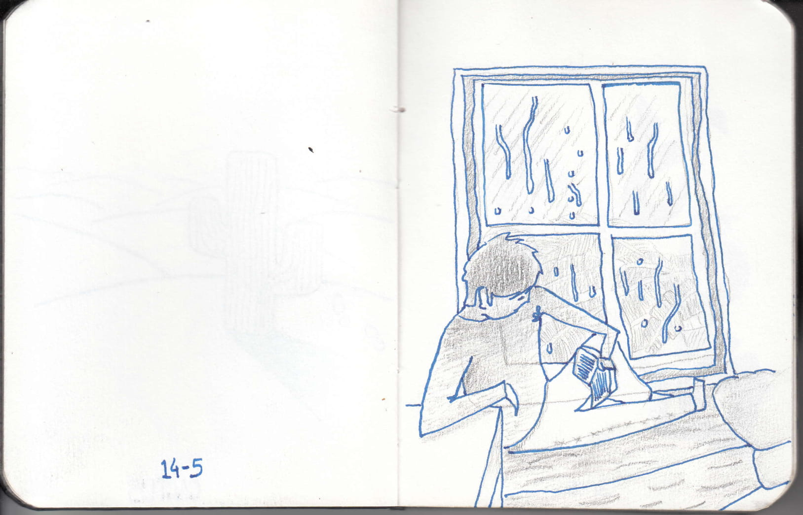

# Home
## About
### Me

  

Hello, I'm Priyansh Sangule, 4th year Computer Science and Engineering student at <a href='https://www.iittp.ac.in'>IIT Tirupati</a>. I am a programmer and casual artist.

### Goal
Further advance the fields of science and arts. Creating low level simple and sharp softwares that help people create and inspire others.

### Contribute

Source files for my projects could be found on <a href='https://www.github.com/abstractxan'>Github</a>. This website is made with C++ using  <a href='https://www.github.com/abstractxan/mizi'>Mizi</a>. Source files for my website are available <a href='https://www.github.com/abstractxan/abstractxan/tree/master/src'>here</a>.
 
Inspired by <a href='https://solar.lowtechmagazine.com/2018/09/how-to-build-a-lowtech-website/'>low-tech web design</a>, most images on this website are <i>dithered</i>.
 
Found a typo? Feel free to open an <a href='github.com/abstractxan/abstractxan/issues/new'>issue</a>.

# Blog
## Karnataka
###  
WIP

# Projects
## Mizi
### Introduction

<a href='https://github.com/abstractxan/mizi'>Mizi</a> is a static website generator written in C++ that takes markdown file as input.

### Philosophy

Mizi is designed to be light weight, minimalistic and convenient. It is created in an attempt to help people create websites easily and without any prior web development experience.

## Mini-projects
### Shooting Stars

<iframe src='https://itch.io/embed/566225' height='167' width='552' frameborder='0'><a href='https://abstractxan.itch.io/shooting-stars'>Shooting stars by AbstractXan</a></iframe>

### Space 

<iframe src='https://itch.io/embed/543741' height='167' width='552' frameborder='0'><a href='https://abstractxan.itch.io/space'>Space by AbstractXan</a></iframe>

## Enigma 2020
### About

Enigma is a competitive ciphering and deciphering heist while looking for clues in the gigantic internet universe. Explore some amazing corners of the web-battling out puzzles and reading between the lines. Got stuck on some questions? Work your way out through your search engines. 

### Leaderboard

<ul><li><b>290 / 355 Kowalski Analysis</b></li><li><b>285 / 355 Living Immortals</b></li> <li>270 / 355 Chillminati</li> <li>270 / 355 Aam Aadmi Party</li> <li>260 / 355 Pigs Are Awesome</li> <li>240 / 355 404!</li> <li>225 / 355 Team Snow</li> <li>215 / 355 strugglers</li> <li>200 / 355 Cicada3301</li> <li>180 / 355 the beacons</li> <li>145 / 355 turingBois</li> <li>135 / 355 The Deathly Hallows</li> <li>120 / 355 execute ?</li> <li>120 / 355 DedSec</li> <li>120 / 355 Anything is fine</li> <li>60 / 355 SaCreD MaFiA</li></ul>

### Goal
Enigma as a medium is our way of exposing the participants to a myriad of exciting places on the internet. We strive to provide an unparalleled experience similar to an open world game — explore the depths of internet for clues, crack mind-bending puzzles, and get to know more about the rad things people are doing in the world.

Every team's journey is unique and depends on how they approach a problem. Every question has a unique solution and it doesn't matter what path you take, it's important to remember <b>what</b> you're looking for. It's easy to get lost, you see.

### Rules
Rulebook can be found <a href='../media/enigma/rulebook.pdf'>here</a>

### Questions
Questions will be posted here soon.

### Creators

 
 

<b>Priyansh Sangule</b>

Prelims & Finals

 
 
<b> Anup Kulkarni</b>
Prelims & Finals

  
 

<b>Aditya Chaudhary </b>
Prelims

  
 
<b>Sibibalan </b>
Prelims

## Enigma 2019
### About

Enigma is a competitive ciphering and deciphering heist while looking for clues in the gigantic internet universe. Explore some amazing corners of the web-battling out puzzles and reading between the lines. Got stuck on some questions? Work your way out through your search engines.

### Feedback

<ul><li>\"Some are mind-bending, some are deep, some are clueless. It's an awesome experience overall.\" <b> — Sai Krupa Reddy, IIT Tirupati</b></li> <li>\"Even though we couldn't come up with proper logics or answers, it was fun!!\"<li><b>—Hemangi Doye, IIM Indore</b></li> <li>\"Horiffying. Enthralling. We loved it! Enjoyed the ride. Wish to solve many more of these again and again.\"<b> — Aparna Vadlamani, IIT Tirupati</b></li> <li>\"It is an awesome,  brain storming event and best one I have ever attempted. I would love to participate even after my B.Tech.\"<b> — Sai Sumanth Vanka, IIT Tirupati</b></li></ul>

### Insight

 Insights for the event could be found <a href='../media/enigma/enigma_2019_insights.png'> here</a>

According to the statistics, we found the prelims results to be really skewed even though the questions were relatively simple compared to finals. We decided to increase the duration of the Prelims for the next event to 12 hours.

### Leaderboards

The following list contains the marks scored and members for the respective teams for Enigma2019 Finals.

<ul><li>222 / 469 Raghav Dhawan | B. Varnika | Sandalika Sapra </li><li>203 / 469 Jakku Sai Krupa Reddy | Dasari Merwin | Sathwik Matsa </li><li>202 / 469 Sai Sumanth Vanka | Vuduthala Pratyusha | Tapan Ganatma </li><li>201 / 469 Aakash Yadav | Bhomik | Vishal </li><li>151 / 469 Rutvik Bade | Ayush Garg | Ravi Shrivatsa </li><li>146 / 469 V Dheeraj | Kalicheti Rishitha</li><li>143 / 469 A Chaitanya | Charan Sai | G Yaswanth </li><li>123 / 469 Manoj kumar | Ritesh Sai T. | Akhil Bharadwaj</li><li>116 / 469 Vasunith Kislay | Manish Kumar Shrivastava | Tejasva Motsara</li><li>101 / 469 Sriram | Akhil | Chandan</li><li>85  / 469 Rohith Sudheer | Prudvi Venkat | Shubham Sangle </li><li> 83  / 469 Reena Deshmukh</li><li> 79  / 469 Aparna Vadlamani | G Sushmita</li><li> 69  / 469 Bodapati Nirupama Sai | Ambati Amulya | Balasa Niharika </li><li> 68  / 469 Ajinkya Kamble | Krishan Kumar Rao | Nakshatra Gupta</li><li> 67  / 469 Raj Garg | Abhishek Kaushik | Deep Ghadiyali </li><li> 66  / 469 Shubhankar Bhadra</li><li> 66  / 469 Abhishek Kumar | Arnab Dutta | Devayan Barindranath Ghosh </li><li> 66  / 469 Shaik Irfan | Vinay Koneru | Yashwant Sai Koneru</li><li> 39  / 469 Nandita V Nair | Kaushal Pillay | Revathy Sajeev </li></ul>

### Questions

Prelims questions were created by both <a href='https://www.twitter.com/AnupKulkarn1'>Anup Kulkarni</a> and I. Questions for finals were created by me. Questions could be found here: <a href='enigma_2019_prelims.html'>prelims</a>

# Resources
## Cryptography
### Links
Unordered list of resources
- [One way function](https://en.wikipedia.org/wiki/One-way_function)
- [Attack Models](https://en.wikipedia.org/wiki/Attack_model) like CPA, CCA, COA
- [Authenticated Encryption](https://en.wikipedia.org/wiki/Authenticated_encryption) 
- [Diffie-Hellman Key Exchange](https://www.khanacademy.org/computing/computer-science/cryptography/modern-crypt/v/diffie-hellman-key-exchange-part-2)
- [RSA Encryption](https://www.khanacademy.org/computing/computer-science/cryptography/modern-crypt/v/intro-to-rsa-encryption)
- [Random Univ Slides](https://www.icg.isy.liu.se/courses/tsit03/)

## Competitive Coding

### Questions
[Classification of questions](https://leetcode.com/discuss/general-discussion/457546/LeetCode-Problem-Patterns-from-educative.io)

[Container with most water](https://leetcode.com/problems/container-with-most-water/) is a brilliant question with an elegant solution that feels like magic. Initial instinct would be to go through the array in O(n^2) time but turns out that it could be brought down to O(n) time and O(1) space complexity. I wish I could classify this problem but I haven't solved these kinda questions enough.
[Reveal cards in increasing order](https://leetcode.com/problems/reveal-cards-in-increasing-order/) is a very good question for testing your knowledge queue implementation.

## Computer Science
### Introduction
[List of unsolved problems in Computer Science](https://en.wikipedia.org/wiki/List_of_unsolved_problems_in_computer_science)

### Operating Systems

University of Washington <a href='https://courses.cs.washington.edu/courses/cse410/99au/lectures/'>lecture slides</a>.

### C/C++

Simple steps to debugging using GDB <a href='https://u.osu.edu/cstutorials/2018/09/28/how-to-debug-c-program-using-gdb-in-6-simple-steps/'>tutorial</a>

### Data Structures

Complete 8 hour <a href='https://www.youtube.com/watch?v=RBSGKlAvoiM'>course</a> ranging from easy to advanced data structures

### IDE 

<a href='https://repl.it'>Repl.it</a> allows users to write code and build apps using a browser, without having to install any software on their devices.

### Developer Podcast

Future of coding <a href='https://futureofcoding.org/episodes/045'>podcast</a> featuring Devine Lu Linvega where he talks about development process of <a href='https://100r.co/site/orca'>Orca</a>, a visual programming environment for making music.

## Docker
### Introduction
- Image : Template for environment (OS, Software, Applications)
- Container : Running instance of an image 
- Dockerfile : Text document that contains all the commands to assemble an image.
- Volumes : Preferred mechanism for persisting data generated by and used by Docker containers
- Kubernetes: Container-orchestration system for automating application deployment, scaling, and management.
### Commands
- docker run image
- docker start container
- docker stop container
- docker ps 
- docker ps -a  (for stopped containers)
- docker rm $(docker ps -a -q)  (remove all stopped containers)
- docker rm container

### Videos

- [Docker in 12minutes](https://www.youtube.com/watch?v=YFl2mCHdv24)
- [What is a container](https://www.docker.com/resources/what-container)
- [Get started](https://docs.docker.com/get-started/)
- [Containers, Docker ands Kubernetes](https://www.youtube.com/watch?v=u8dW8DrcSmo)
- [Docker Compose](https://www.youtube.com/watch?v=Qw9zlE3t8Ko) for multiple containers.

Last updated 22 March 2020
## C++ STL
### Vector
[ | | | | =>
- [Fast] Insert at back: <b>O(1)</b>
- [Slow] Insert in beginning or middle: <b>O(n)</b>
- [Slow] Search: <b>O(n)</b> 

- #include &lt;vector&gt
- vector&lt;int&gt vec;
- vec.push_back(5);
- vec.at(0); //Throws range_error exception
- vec.empty(); //<b>bool</b> Check if empty
- vec.size();
- vector&lt;int&gt; vec2(vec); // Copy constructor copies vec into vec2
- vec.clear();
- vec.swap(vec2);
Iterators
- for(vector&lt;int&gt;::<b>iterator</b> itr = vec.begin(); itr!=vec.end(); itr++){
- &nbsp; cout &lt;&lt;  *itr &lt;&lt; endl; // *itr gives value stored
- }
Alternatively for C++11,
- for(auto it:vec) // Use &it for reference, if one wants changes in values
- &nbsp; cout &lt;&lt; it &lt;&lt; endl; 

### Deque
<= | | | | =>
- [Fast] Insert at front and back: <b>O(1)</b>
- [Slow] Insert in middle: <b>O(n)</b>
- [Slow] Search: <b>O(n)</b> 
Implementation similar to vector
- #include&lt;deque&gt;
- deque&lt;int&gt; deq = {4,6,7};
- deq.push_front(3);
- deq.push_back(8); 

### List
 [ ] <-> [ ] <-> [ ]
- [Fast] Insert and Remove anywhere: <b>O(1)</b>
- [Slow] Search: <b>O(n)</b> 
Implementation
- #include&lt;list&gt;
- list&lt;int&gt; listt = {5,2,9};
- listt.push_back(2);
- listt.push_front(1);
Find
- list&lt;int&gt;::iterator itr = <b>find</b>(listt.begin(), listt.end(),2); //itr -> 2
Insert
- listt.insert(itr, 8); // Inserts in front of itr
- itr++
- listt.erase(itr)
Splice: Copies elements from list2 (from itr_a to itr_b) to list1 at itr
- list1.splice(itr,list2,itr_a,itr_b);

### Array
Thin layer around the naked array.
- int a[3] = {3,4,5};
- array&lt;int,<b>3</b>&gt; a = {3,4,5}; // Array container of type (int,3)
Limitations
- Size is fixed : array&lt;int,<b>fixed_size</b>&gt;;
- array&lt;int,<b>3</b>&gt; and array&lt;int,<b>4</b>&gt; are different types.
Usage
- a.swap();
- a.size();
- a.begin();
- a.end();

### Set 
- [Slow] Insert <b>O(log(n))</b>
- [Fast] Search <b>O(log(n))</b>

- <b>Non duplicate data
- Value of elements cannot be modified</b>

Do not use sets for simpler problems as insertion takes time and will cause performance issues.

- #include&lt;set&gt;
- set&lt;int&gt; myset;
- myset.insert(2);
- set&lt;int&gt;::iterator it;
- it = myset.<b>find</b>(7);

- pair&lt;set&lt;int&gt;::<b>iterator, bool</b>&gt; ret; // ret.second='false' if already exists
- ret = myset.insert(3);
Insert via <i>hint</i>.
- myset.insert(itr,9);
'itr' is hint. O(log(n)) => O(1). The better the hint, the better the performance.
Erase
- myset.erase(itr);
- myset.erase(7); // By <b>value!</b>  

### Multiset
- [Fast] Search O(log(n))
- [Slow] Traversing
- <b>A set that allows duplicate items
- Value of elements cannot be modified</b>

- multiset&lt;int&gt; myset;
### Map
- [Fast] Find O(log(n))
- <b> No duplicate key
- Keys cannot be modified
- Type of itr: pair&lt;char,int&gt;</b>
Implementation
- map&lt;char,int&gt; mymap;
Insertion
- mymap.insert(pair&lt;char,int&gt;('a',100));
- mymap.insert(make_pair('z',200));
- mymap.insert(itr,pair&lt;char,int&gt;('a',300)); // itr is a hint.

### Multimap
- <b>Allows duplicate keys
- Keys cannot be modified
- Type of itr: pair&lt;char,int&gt;</b>

- (*itr).first = 'd'; // Error
### Resources
- [Associative containers](https://www.youtube.com/watch?v=6iyzPed7FrM)

# Miscellaneous
## Sketchbook 2019
### Sketches

                                                        

$$$ Seperate Pages
## Casual Discoveries
### Coding

- Sets are slower! Frek my runtime.
- Iterators add overhead? Maybe..
- Inplace algorithms improve space complexity
- WHAT ARE BIT VECTORS UGH

## Experiments with life
### Introduction
Being constantly dissatisfied with myself, I feel very stagnated in life. To come out of these badlands, I'll be writing blogs on my experiments on myself.

### Workouts
A set of body workouts including: Gym workouts, Yoga and Meditation on a daily basis.

### Productiviity
Every work using pomodoro.

Factors that help improve productivity:
- Casual debate with someone
- Cooking
- Drawing
- Getting inspired

Factors that hinder productivity:
- Trying to do a lot of work at once
- Keep sitting at a single place
- Excessive gaming (drains the mind)

### Tracker
Currently, I'm building a personal tracker for productivity and projects. I'll be posting daily progress here until then. Every time slot is broken down into pomodoros i.e 25min.

Glossary:
- <b>E</b> : Exercise
- <b>G</b> : Gaming
- <b>H</b> : Hygiene
- <b>M</b> : Meditation
- <b>Mu</b> : Music
- <b>S</b> : Study
- <b>Y</b> : Yoga

Log :
- 24 March 2020 : E,Y,M,Mu,G,G,S,S,S,S,S,S,Mu,Mu,Mu,G,G,G,G,G,G,G,G
- 25 March 2020 : E,Y,M,M,S,H,S,G,G,G,G,G,G,S,S,S,S,S,S,S,S,S,S,G,G,G,G,G,G
- 26 March 2020 : E,Y,M,S,S,S,S,S,S,S,S,S,G,G,G,G,G,G,G,G
- 27 March 2020 : Y,M,S,S,S,S,S,S,S,G,G,G,G,G,G,G,G
- 28 March 2020 : M,S,S,S,S,S,S,

Last Updated: 28 March
## Enigma 2019 Prelims
### Rules

Event is 3hrs from 9 to 12pm (midnight). Only one submission per team. Multiple submission will lead to disqualification. Enter valid names as registered on Tirutsava website. Failing to do so will lead to disqualification

<ol><li>1.1 We strongly recommend using internet the greatest gift of the god to its fullest potential.</li><li>1.2 Failure to use god's gift will be considered as blasphemy and the participant will be rendered unable to solve even a single question.</li><li>2 We all at enigma love wearing hats and will greatly appreciate not using any caps in the answers.</li><li>3 Due to recent court hearings all contestants are required to enjoy the storyline embedded in the contest. Failure to do so will result in boredom.</li><li>4 Order of court can be ignored but one shall not ignore the order of questions.</li><li>5 Thou shall be ranked by your intellectual potential to score marks and submit fast</li><li>6 Thou shalt doubt our intellect by wondering how many answers a question has. Just like god they is only one true answer and that's ours.</li><li>7 Thou shall submit on or before 12 midnight</li></ol>

Special thanks to people who just convinced coke to sponsor <a href='https://www.tirutsava.com'>Tirutsava</a>

Wubba Lubba Dub Dub!

### Enigma 2: Paradise Falls

In a future far unseen an architect was busy working on a paradise for the whole humanity. It  was a world without suffering, an Utopian society and a prison for minds trapped in the dimension of virtual reality.

It was a facade build to enslave the minds. It was the matrix.

It was the first prototype matrix which stimulated the New-York city. Equipped with all the pleasure one can wish for it was just one component away from completion. The matrix was filled with millions of trapped minds. It needed much required order and someone to maintain it for eternal of enslavement of the human race.
;

### Chapter 1: The first program

Program of Agent Smith was almost done all it needed was the initiation sequence, hidden in plain sight for everyone to see the sequence was also supposed to be the first sentence of the unstoppable program called Agent Smith.

1. Enter the initiation sequence [1 point]

### Chapter 2: Et tu, Brute?

Agent Smith received the communication protocol to interact with other programs in the Matrix. Once initiated, his memory was flooded with welcome messages. But one caught his attention the most.

2. anfuvfivbyngvat [1 point]

### Chapter 3: Browsing the Matrix

Agent Smith scanned the log files in search of the sender. The name of which appeared to be a code.

3. #FF0000 Panda [2 points]

### Chapter 4: The Company of Myself

A girl turned on her computer inside her \"new\" house in New-York. This new-comer to the matrix was met with a strange message on her PC screen \"#FF0000 Panda  invites you to play the GAME\" well that was a bit weird.

<a href='https://www.kongregate.com/games/2DArray/the-company-of-myself'>kongregate.com/games/2DArray/the-company-of-myself</a>

4. Minimum number of shadows needed in level 19 [3 point]

5. Minimum number of lever presses by \"Jack\" (the hat man) needed to finish the game. Ignore levers triggered by images [3 point]

### Chapter 5: 2̶0̶4̶8̶ 2084

Adriana felt something she had not felt before in this strange new city of New-York. Next day her screen was ready with another message:
<ul><li>\"The prime program chooses one to be free, are you worthy?\"</li><li> \"Arjen Anthony Lucassen\"</li><li> \"ITBlueMagma\"</li></ul>

6. r/X ; 'X'=? [5 points]

Corner case end

X is the answer but not the correct one.

7. Vigenére agrees - you know the key. [5 points]

### Chapter 6: The Kombat

8. \"Only person to follow the relative by the marriage whose blood code is 45-26\"[8 points]

### Chapter 7: Intertwined

Adriana progresses further

9. Part 1: {87.73, -86.18, 83.18} lacieb nag a ram [13 points]

10. Part 2: Answer to Part 2 = Answer to part 1 + sativum [13 points]

11. Part 3: Gabriel Picolo's famous series has this character [13 points]

12. Part 4: If this sentence is true, then Santa Claus exists. Is the answer to this question 'No'? What is common in the above statements. [13 points]

13. End of Chapter 6: Final hint: u/onionchowder. All above answers point to this. [13 points]

### Chapter 8: The Golden Commandment

Adriana was confused by all the random questions but she was still curious. World around her had always felt odd to her but she could never figure out what was so wrong with this apparently perfect world? What was that little something her world lacked? Her monitor blinked again this time with a link.
 
<i>\"<a href='https://youtu.be/i2TMDz05I7k'>https://youtu.be/i2TMDz05I7k</a>\".</i>

\"This is the Golden Question you always had in your heart. So hurry up and get there fast. Before it is destroyed by a certain someone who might reach there before you\".

14. The first team to crack will be the only one to solve. And this realization made Adriana Shiver [21 points]

### Chapter 9: The Chase Begins

Agent Smith was relieved to finally track down rogue program #FF0000 Panda. He transferred all remains of the #FF0000 Panda to his memory and started looking for the loose ends.

### Chapter 10: The Turing Machine

Eliminating the girl and erasing everything was what Agent Smith desired. He reached her apartment to find her PC on and transmitting a video. It had a unbreakable code as its password but he had an infinite mind at his disposal.

\"It was the first machine of its kind designed to destroy the old world \"

\"You Know What BM3? some squares have magical properties\"

\"hzyoi kbnsw uqbhg ltfsg pyrkz mkldz yap\"

15. Enter The Password [33 points]

### Epilogue: The Final Sequence

Adriana tuned in a news channel. \"Good people of New-York, don\'t believe the false information spread by some terrorists to harm our great nation. NYPD has made multiple arrests in past couple of weeks regarding the video broadcast by the same terrorist outfit to induce widespread public fear.\" She quickly turned it off and leaned back on her chair. The people were slowly rejecting the matrix just like her unable to cope up with the reality so perfect. Symptoms were visible from last few weeks and everyone was feeling them. Things were getting progressively bad. She was feeling her vision slowly get blurry. She got up and walked to the balcony. People on street were falling down and cars were crashing into objects and people one after other. But she couldn\'t see any of it as her vision quickly faded and her head became light. It was the most sad day of the Architect\'s life as her precision matrix was off the grid. The perfect place of humanity was rejected by its inhabitants The Paradise Matrix has fallen.

16. I hope you\'ve been watching closely [54 points] 

